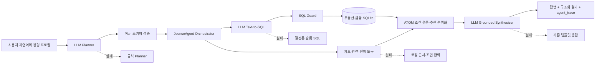

# 청년 주거·금융 Agentic Search System 아키텍처

작성일: 2026-07-16  
대상 코드: `jeonse_helper`

## 1. 구현 결과 요약

이 프로젝트의 LLM은 이제 단순 의도 분류기가 아니다. 한 사용자 턴을 다음 세 개의
서로 격리된 LLM 역할과 결정론적 실행 코드가 처리한다.

1. **Planner**: 자연어를 의도, 정규화 슬롯, 도구 계획으로 변환한다.
2. **Text-to-SQL**: 확인된 슬롯과 허용 스키마를 바탕으로 읽기 전용 SQL을 만든다.
3. **Grounded Synthesizer**: DB와 도구가 실제로 반환한 결과만 사용해 답변을 작성한다.

LLM이 계산이나 DB 접근을 직접 수행하지는 않는다. LLM은 계획과 SQL 문자열을
제안하고, Python 오케스트레이터가 검증된 도구만 실행한다. 모든 실패는 재시도 후
결정론적 폴백으로 격리하며 `agent_trace`에 남긴다.



## 2. 사용자 그림과 코드의 1:1 대응

| 그림의 구성요소 | 실제 구현 | 주요 파일 |
|---|---|---|
| 자연어 기반 희망사항 | 의도·거래유형·지역·예산·주택유형·통근·안전 조건 추출 | `src/agent/prompts.py`, `src/agent/llm.py`, `src/agent/planner.py` |
| 정량화된 사용자 정보 | 나이, 월소득, 자산, 생활비, 소득분위, 선호지역 세션 저장 | `src/schemas.py`, `src/agent/harness.py` |
| Agentic Search System | 상태 관리, 확인 대화, 도구 선택, 실행, 검증, 폴백, 합성 | `src/agent/harness.py`의 `JeonseAgent` |
| Tool Calling | 지도, POI, 안전, 편의, 금융, 시세, 등기 안내 도구 호출 | `src/tools/`, `src/agent/harness.py` |
| Text2SQL | SQL 생성, 오류를 이용한 수정 재시도, 슬롯 SQL 폴백 | `src/agent/text2sql.py` |
| RDB RAG | SQLite에서 부동산 매물과 금융상품을 검색해 LLM에 근거 제공 | `src/tools/property_db_tool.py` |
| 부동산 데이터 DB | 합성 매물 20,000건의 `properties` 테이블 | `data/generated/jeonse_helper.db` |
| 금융서비스 DB | `finance_programs` 테이블 | `src/db/build_db.py`, 동일 SQLite DB |
| Naver Map API 영역 | API 키가 있으면 외부 길찾기, 없으면 로컬 거리 기반 근사 | `src/tools/map_tool.py` |
| Direction API 영역 | `travel_time`, `regions_within` 인터페이스 | `src/tools/map_tool.py` |
| 최종 자연어 응답 | 도구 결과만 주입하는 근거 기반 합성 | `src/agent/llm.py`의 `synthesize()` |
| 재시도·fallback | HTTP 오류 분류, 지수 백오프, 단계별 결정론 폴백 | `src/agent/reliability.py`, `src/agent/text2sql.py`, `src/agent/harness.py` |

그림에 표시된 **Fine-tuned**는 현재 구현 상태와 다르다. 현재 OpenAI 모델은 별도
파인튜닝하지 않았고 Structured Output 시스템 프롬프트를 사용한다. 프로젝트에서
학습된 모델은 전세사기 위험 모델과 추천 모델이다. 추후 충분한 익명 대화·정답 SQL
데이터가 확보되면 Planner/Text-to-SQL만 별도로 파인튜닝할 수 있다.

## 3. 한 턴의 구체적인 실행 순서

### 3.1 입력과 세션

`JeonseAgent.new_session()`은 정형 사용자 프로필과 대화 상태를 보존한다.

- 사용자 프로필: 나이, 월소득, 총자산, 월생활비, 소득분위, 선호 시도
- 대화 상태: 확인 대기 여부, 확인할 슬롯, 지도 선계산 결과, 원래 사용자 문장
- 이전 턴의 확인 조건은 사용자가 `응/yes`라고 답했을 때 그대로 실행된다.

### 3.2 LLM Planner

`APILLM.plan()`이 OpenAI Responses API를 호출한다. 출력은 자유 문장이 아니라
`PLAN_JSON_SCHEMA`를 따르는 Structured Output이다.

대표 입력:

```text
서울 관악구에서 5천만원 이하의 안전한 아파트 전세를 찾아줘
```

대표 정규화 결과:

```json
{
  "intent": "recommend",
  "action": "confirm",
  "slots": {
    "transaction_type": "전세",
    "lease_type": "전세",
    "property_type": "아파트",
    "region_sido": "서울",
    "region_gugun": ["관악구"],
    "max_deposit_manwon": 5000,
    "max_fraud_score": 0.2,
    "safety_is_hard": true
  },
  "tool_calls": [{"tool": "property_search"}]
}
```

Structured Output의 `null` 값은 Python 변환 단계에서 제거한다. 모델이 추천 또는
금융 검색 도구를 빠뜨리더라도 `_plan_from_data()`가 의도에 맞게 필수 도구를 보정한다.

### 3.3 사용자 확인

추천 조건이 하나라도 추출되면 바로 검색 결과를 확정하지 않고 `confirm` 상태를
반환한다. 사용자가 확인하면 검색하고, 수정 내용을 말하면 기존 슬롯과 새 슬롯을
병합한 후 다시 확인한다. `아무거나 추천해줘`만 확인 없이 실행한다.

### 3.4 Text-to-SQL

`Text2SQLPipeline.search_properties()`와 `search_finance()`가 담당한다.

모델에 주는 입력은 다음 세 부분이다.

1. `PRAGMA table_info`로 실행 시점 SQLite의 실제 컬럼을 읽는
   `PropertyDBTool.schema_prompt(allowed_tables)`
2. Planner가 검증한 슬롯 JSON
3. 사용자의 원문과 이전 SQL 오류

예시 SQL:

```sql
SELECT property_id, is_synthetic, synthetic_notice, sido, gugun, dong,
       lat, lng, transaction_type, lease_type, property_type, house_type,
       asking_price_manwon, sale_price_manwon, deposit_manwon,
       monthly_rent_manwon, maintenance_fee_manwon, market_price_manwon,
       area_m2, building_age_years, my_priority_rank, building_total_units,
       fraud_score
FROM properties
WHERE lease_type = '전세'
  AND sido = '서울'
  AND gugun = '관악구'
  AND house_type LIKE '%아파트%'
  AND deposit_manwon <= 5000
  AND fraud_score <= 0.2
LIMIT 500
```

생성 SQL이 문법적으로 맞더라도 확인된 슬롯의 컬럼 조건을 빠뜨리면 실행하지 않는다.
`_assert_slot_coverage()`가 거래유형, 지역, 주택유형, 금액, 면적, 연식, 위험도 조건의
포함 여부를 검사한다.

금융 자연어는 다음 의미 모드로 먼저 정규화한다.

- `catalog`: “금융지원책 뭐가 있지”처럼 전체 제도를 묻는 경우. 개인 소득 WHERE를
  적용하지 않는다.
- `eligibility`: “내가 받을 수 있어?”처럼 개인 적격성을 묻는 경우에만 프로필 조건을
  적용한다.
- `product_kind`: 대출·지원·주거공급·청약을 명시했을 때만 상품 종류를 제한한다.
  첨부 정책 DB의 `product_kind` 컬럼을 `LIKE` 검색하며, 일반적인 “금융지원책”은
  문자 그대로 `category LIKE '%지원%'`으로 바꾸지 않는다.
- `max_rate_pct`: “2% 미만”은 `rate_pct < 2`로 보존하고 LLM SQL과 폴백 SQL 양쪽에서
  누락 여부를 검증한다.

#### 금융을 활용한 전세 최대화 복합 목표

“금융상품을 활용해 최대한 비싼 전세를 추천해줘”는 금융상품 목록을 묻는
`qa_finance`가 아니다. Planner는 이를 `goal_financed_jeonse`로 분류하고 다음 목표
파이프라인을 한 턴 안에서 순서대로 실행한다.

1. `finance_text2sql`: 나이·연소득·희망지역을 적용해 적격 금융정책을 RAG한다.
2. `financing_budget_calculator`: 정책을 직접 전세자금과 보증료 등 비용 절감 제도로
   구분한다. 무관한 청약·기숙사 정책은 예산에 더하지 않는다.
3. 자기자금 적정 전세예산에 가장 큰 단일 직접 전세대출의 유효 한도만 더한다.
   여러 상품 한도는 중복 합산하지 않으며 금리·한도가 확인되지 않으면 예산을 늘리지
   않는다.
4. `property_text2sql`: 계산된 보증금 상한을 `WHERE deposit_manwon <= ...`로 넣어
   전세 매물을 RAG한다.
5. `goal_ranker`: 상한 내 보증금이 큰 순으로 정렬하고, 같은 가격이면
   `fraud_score`가 낮은 후보를 우선한다.
6. `synthesize`: 금융 근거, 계산 결과, 매물 근거를 함께 읽고 실행 방안으로 답한다.

이 과정은 모델의 비공개 사고과정을 노출하는 방식이 아니다. `agent_trace.workflow`와
각 tool trace에는 실행된 단계, SQL, 입력 필터, 행 수, 계산 결과만 감사 가능한
구조화 정보로 기록한다. LLM이 이 문장을 단순 금융 Q&A로 잘못 분류하더라도 명시적인
“금융 활용 + 전세 + 최대화 + 추천” 패턴은 결정론 의미 보정기가 복합 목표로 복원한다.

### 3.5 RDB 검색과 RAG

여기서 RAG는 문서 임베딩 검색이 아니라 **RDB 기반 retrieval**이다. 생성 SQL로
SQLite 행을 가져오고 그 행만 추천 및 답변의 근거로 사용한다.

- `properties`: 모든 주택유형의 합성 매매/전세/월세 매물
- `finance_programs`: 첨부 청년 주거·금융 정책 6건(정책번호 기준 중복 제거, 46개 컬럼)
- `region_accident_stats`: 지역별 보증사고 통계

부동산 결과는 `is_synthetic`와 `synthetic_notice`를 최종 응답까지 보존한다. 따라서
LLM이 합성 매물을 실제 중개 플랫폼에 현재 올라온 실매물이라고 표현해서는 안 된다.

### 3.6 Tool Calling

도구 호출은 LLM이 임의 Python 함수를 실행하는 방식이 아니다. Planner가 허용된
도구 이름을 계획에 넣고 `JeonseAgent`가 등록된 도구만 호출한다.

| 도구 | 역할 | 실제/폴백 |
|---|---|---|
| `property_text2sql` | 부동산 RDB 후보 검색 | LLM SQL → 슬롯 SQL |
| `finance_text2sql` | 금융상품 RDB 검색 | LLM SQL → 파라미터 SQL |
| `map_regions_within` | 목적지 제한시간 내 지역 후보 | 지도 API 또는 거리 근사 |
| `map_travel_time` | 매물별 통근시간 | 지도 API 또는 거리 근사 |
| `poi_search` | 역·병원·마트 등 주변 시설 | 외부 API 또는 mock |
| `safety_assess` | CCTV·경찰·소방 등 안전 인프라 | 내려받은 safety CSV |
| `convenience_assess` | 편의점 등 생활편의 | SafeMap API 캐시 또는 로컬 데이터 |
| `market_appraise` | 매물 가격과 기준 시세 비교 | 로컬 계산/데모 데이터 |
| `registry_guide` | 등기부 확인 안내 | 규칙 기반 체크리스트 |
| `affordability` | 소득·자산 기반 적정 예산 | 정적 공식 |

### 3.7 ATOM 검증과 추천

SQL은 후보 retrieval이고 최종 조건 판정은 `src/agent/atoms.py`가 다시 수행한다.
지역, 거래유형, 주택유형, 예산, 월세, 면적, 연식, 위험도, 통근 등의 조건을 원자적
predicate로 평가한다. 추천은 완전 만족, 조건 1개 양보, 조건 2개 양보 그룹으로 나눈다.
예산과 사용자가 hard로 지정한 안전 조건은 기본적으로 타협하지 않는다.

이 이중 검증 때문에 LLM SQL이 넓은 후보를 조회하더라도 조건에 맞지 않는 매물이
조용히 최종 결과로 들어가는 것을 막는다.

### 3.8 Grounded Synthesis

`APILLM.synthesize()`에는 사용자 질문과 도구 결과 JSON만 전달한다. 내부 trace와
API 키는 전달하지 않는다. 프롬프트는 다음을 강제한다.

- `_manwon` 필드는 항상 만원 단위로 읽는다.
- 합성 데이터를 실매물이라고 단정하지 않는다.
- `fraud_score`를 전세사기 추정 위험도라고 표현한다.
- 금융 자격은 최종 심사가 필요함을 표시한다.
- 등기부·건축물대장·보증 가입의 별도 확인 필요성을 알린다.
- 폴백이 결과 품질에 영향을 주면 숨기지 않는다.

합성 호출이 실패해도 구조화 결과는 이미 만들어졌으므로 CLI/GUI는 기존 템플릿으로
정상 응답한다.

## 4. 시스템 프롬프트 위치

모든 프롬프트는 `src/agent/prompts.py` 한 파일에서 감사할 수 있다.

| 상수 | 적용 단계 | 핵심 책임 |
|---|---|---|
| `AGENT_SYSTEM_PROMPT` | Planner | 의도, 슬롯, 도구, 확인 행동 생성 |
| `PLAN_JSON_SCHEMA` | Planner 출력 | 허용 의도·슬롯·도구의 타입 강제 |
| `SQL_SYSTEM_PROMPT` | Text-to-SQL | 스키마 한정 SELECT 생성 |
| `SQL_JSON_SCHEMA` | SQL 출력 | `sql`, `purpose` 필드 강제 |
| `SYNTHESIS_SYSTEM_PROMPT` | 최종 답변 | 도구 근거, 단위, 안전 고지 강제 |

OpenAI 호출 구현은 `src/agent/llm.py`의 `_request_json()`과 `_request_text()`에 있다.
Structured Outputs를 지원하지 않는 Anthropic 경로는 스키마를 프롬프트에 넣고 로컬
JSON 파싱과 검증을 수행한다.

## 5. SQL 보안 파이프라인

`PropertyDBTool`은 다음 순서로 LLM SQL을 방어한다.

1. 문자열 길이 제한과 빈 SQL 차단
2. 단일 `SELECT`만 허용
3. 세미콜론 다중 문장과 SQL 주석 차단
4. DML, DDL, `PRAGMA`, `ATTACH`, `load_extension` 등 금지
5. `properties`, `finance_programs`, `region_accident_stats` 허용 목록 검사
6. 요청 도구의 대상 테이블만 스키마 프롬프트에 노출
6. 목적별 테이블 범위 재제한
7. 확인 슬롯의 SQL 커버리지 검사
8. SQLite URI `mode=ro`로 읽기 전용 연결
9. `PRAGMA query_only=ON`
10. SQLite authorizer로 허용 테이블·컬럼·안전 함수만 읽기 허용
11. progress handler로 과도한 쿼리 중단
12. 최대 500행만 반환
13. 추천에 필요한 필수 SELECT 컬럼 검사

SQL을 문자열 검증만 하고 일반 쓰기 연결에서 실행하지 않는 이유는 우회 표현이나
파서 누락이 생겨도 DB 자체 읽기 전용 계층이 마지막 방어선이 되게 하기 위해서다.

## 6. 재시도와 폴백 파이프라인

### 6.1 LLM API 호출

`src/agent/reliability.py`의 `call_with_retry()`가 지수 백오프와 jitter를 적용한다.

- 재시도: HTTP 408, 409, 429, 500, 502, 503, 504, timeout, connection 오류
- JSON 파싱/스키마 오류: 동일 모델에서 다시 생성
- 즉시 중단: 일반적인 400, 인증 401, 권한 403 등 재시도로 해결되지 않는 오류
- 기본 횟수: 총 3회
- 1차 모델 사용 불가 시: 인증·권한 오류가 아닌 경우 `gpt-4o-mini` 한 번 전환

OpenAI SDK의 자동 재시도는 `max_retries=0`으로 끄고 애플리케이션 계층에서만 제어해
실제 호출 횟수와 trace가 일치하게 했다.

`JEONSE_LLM=api`를 명시했는데 API 클라이언트 초기화가 실패하면 기본적으로 즉시
종료한다. 실제 LLM 장애를 정상 Mock 동작으로 숨기지 않기 위해서다. 초기화 단계의
Mock 폴백이 꼭 필요한 개발 환경에서만 `LLM_ALLOW_INIT_FALLBACK=1`을 명시한다.

### 6.2 단계별 폴백

| 실패 단계 | 재시도 | 최종 폴백 | 서비스 결과 |
|---|---|---|---|
| Planner API | transient/JSON 오류 최대 3회 | 정규식 `Planner` | 검색·Q&A 계속 가능 |
| 1차 OpenAI 모델 | 조건부 | `gpt-4o-mini` 1회 | 성공 시 정상 계획 |
| LLM SQL 생성 | API 재시도 | SQL 오류를 넣어 1회 repair | 수정 SQL 실행 |
| SQL 검증/실행 | repair 1회 | `build_query(slots)` | 결정론 검색 |
| 금융 SQL | 동일 | `FinanceTool.search()` | 파라미터 바인딩 조회 |
| 지도 도구 | 도구 내부/호출 격리 | 거리 근사 또는 지역조건 없이 계속 | 제한된 추천 |
| 지역 결과 없음 | 해당 없음 | 구군 → 시도 순서로 완화 | 후보 확대 |
| 수치 필터 결과 없음 | 해당 없음 | SQL 후보만 넓히고 ATOM에서 재검증 | 안전 조건 유지 |
| 위험도 후보 부족 | 해당 없음 | 데이터 30분위, 최대 0.5까지 명시적 완화 | trace와 안내 기록 |
| 최종 LLM 합성 | API 재시도 | CLI/GUI 템플릿 | 구조화 결과 보존 |

### 6.3 설정 환경변수

```powershell
$env:JEONSE_LLM = "api"                # api | mock | qwen | auto
$env:LLM_PROVIDER = "openai"           # openai | anthropic
$env:LLM_MODEL = "gpt-4.1-mini"
$env:LLM_FALLBACK_MODEL = "gpt-4o-mini"
$env:LLM_MAX_ATTEMPTS = "3"
$env:LLM_RETRY_BASE_SECONDS = "0.35"
$env:LLM_RETRY_MAX_SECONDS = "2.0"
$env:LLM_TIMEOUT_SECONDS = "30"
```

## 7. 감사 추적 `agent_trace`

모든 응답에는 다음 구조가 추가된다.

```json
{
  "agent_trace": {
    "planner": {
      "strategy": "api",
      "provider": "openai",
      "model": "gpt-4.1-mini",
      "fallback": false,
      "attempts": []
    },
    "tools": [
      {
        "tool": "property_text2sql",
        "strategy": "llm_text2sql",
        "final_sql": "SELECT ...",
        "row_count": 42,
        "fallback": false
      }
    ],
    "fallbacks": [],
    "synthesis": {"strategy": "llm_grounded", "ok": true}
  }
}
```

GUI 사용자에게는 기본적으로 답변과 추천 결과를 보여주고, API 사용자는 trace로 어떤
모델·SQL·폴백이 결과를 만들었는지 검증할 수 있다. 운영 환경에서는 SQL 공개 범위를
관리자 권한에 따라 제한하는 것이 좋다.

## 8. 실행 방법

### CLI

```powershell
cd D:\연구\FlexML\kb\jeonse_helper
py -3 -m src.agent.cli
```

기본 설정은 실제 OpenAI API다. 완전 오프라인 확인은 다음과 같다.

```powershell
$env:JEONSE_LLM = "mock"
py -3 -m src.agent.cli
```

### GUI 서버

```powershell
cd D:\연구\FlexML\kb\jeonse_helper
$env:JEONSE_LLM = "api"
py -3 -m uvicorn src.server.app:app --host 127.0.0.1 --port 8000
```

브라우저에서 `http://127.0.0.1:8000/gui`를 연다. `/health` 응답의 `agentic=true`와
파이프라인 배열로 실제 Agentic 모드 초기화를 확인할 수 있다.

## 9. 테스트 방법과 2026-07-16 결과

```powershell
$env:PYTHONIOENCODING = "utf-8"
$env:JEONSE_LLM = "mock"
py -3 -m tests.test_agentic_pipeline
py -3 -m tests.test_integration
py -3 -m tests.test_data_augmentation
```

검증한 항목:

- 매매·아파트·5억원을 구조화 슬롯으로 추출
- 다중 문장, SQL 주석, `load_extension`, 비허용 테이블 차단
- 잘못된 LLM SQL에 오류를 넣어 repair 후 실행
- Text-to-SQL 미지원 시 슬롯 SQL 폴백과 trace 기록
- HTTP 429 두 번 실패 후 세 번째 성공
- 기존 지도·금융·추천·안전·편의·CODEF 회귀 테스트
- 기존 데이터 증강 테스트

실제 OpenAI 테스트:

```powershell
$env:RUN_LIVE_OPENAI_TEST = "1"
$env:JEONSE_LLM = "api"
py -3 -m tests.test_openai_live
```

`gpt-4.1-mini`의 Structured Planner 호출이 성공했고, 별도 수동 E2E에서 확인 후
Text-to-SQL, 읽기 전용 DB 실행, 추천, 최종 자연어 합성까지 성공했다. 실험 중 발견한
만원 단위 과장 가능성과 SQL 슬롯 누락 가능성은 각각 합성 프롬프트와 슬롯 커버리지
검증으로 보강했다.

## 10. 현재 한계와 운영 전 과제

- `properties` 20,000건은 17개 시도·252개 시군구에 균형 배정한 **합성 매물**이다.
  서울·경기 실거래 구조를 KB 시도 가격계수로 전국 공간에 보정한 프록시이며 현재
  판매 중인 실매물이나 전국 실제 실거래 원본 DB가 아니다.
- 금융정책 DB는 사용자가 첨부한 정책 포털 원문을 정규화한 스냅샷이다. 원문의
  `최종 수정일`은 보존하지만 최신 조건을 자동 수집하는 운영 크롤러는 아니다.
- Naver 지도 자격증명이 없으면 정확한 실시간 대중교통 길찾기 대신 근사를 사용한다.
- POI·시세 Q&A의 기본 좌표는 사용자가 매물을 선택하기 전에는 예시 좌표다.
- 현재 LLM은 파인튜닝 모델이 아니다. 프롬프트/스키마 기반이며, 파인튜닝 전에는
  trace를 축적해 슬롯 정확도와 execution accuracy를 먼저 평가해야 한다.
- 하드코딩된 API 키가 있으므로 외부 저장소 공개 전에는 반드시 폐기·교체하고 환경변수
  또는 secret manager로 이동해야 한다.

## 11. 설계 근거

- OpenAI Structured Outputs는 단순 JSON mode보다 스키마 준수를 보장하므로 Planner와
  SQL 출력에 사용했다.
- OpenAI 오류 가이드의 429/500/503 처리 방향에 맞춰 일시적 오류만 백오프 재시도한다.
- SQL은 LLM 출력 신뢰가 아니라 최소권한, 읽기 전용 연결, 이중 조건 검증을 기반으로
  안전성을 확보한다.

공식 참고 문서:

- https://developers.openai.com/api/docs/guides/structured-outputs
- https://developers.openai.com/api/docs/guides/error-codes
