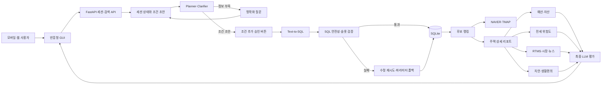

# KB HouseAgent

청년이 매매·전세·월세 주택을 찾을 때 필요한 **매물 검색, 금융상품 자격 조회, 전세보증사고 위험 설명, 통근 검증, 장기 자산 시뮬레이션**을 하나의 Agentic AI 흐름으로 제공하는 의사결정 지원 프로토타입입니다.

팀명: **똘똘한최**

> 이 저장소는 연구·시제품용입니다. 금융상품 가입, 대출 승인, 보증 가입, 등기 안전성 및 미래 집값을 보장하지 않습니다. 실제 계약 전에는 금융기관, HUG·HF, 공인중개사, 법률·세무 전문가 및 최신 원문을 반드시 확인해야 합니다.

## 목차

1. [주요 기능](#주요-기능)
2. [전체 아키텍처](#전체-아키텍처)
3. [Agentic 검색 흐름](#agentic-검색-흐름)
4. [주요 모듈](#주요-모듈)
5. [데이터와 데이터베이스](#데이터와-데이터베이스)
6. [위험도와 자산 시뮬레이션](#위험도와-자산-시뮬레이션)
7. [설치와 실행](#설치와-실행)
8. [외부 API 설정](#외부-api-설정)
9. [테스트](#테스트)
10. [Docker와 배포](#docker와-배포)
11. [API 요약](#api-요약)
12. [프로젝트 구조](#프로젝트-구조)
13. [보안과 데이터 이용 주의](#보안과-데이터-이용-주의)
14. [관련 문서](#관련-문서)

## 주요 기능

### 자연어 기반 주택 검색

- 지역, 거래 유형, 주택 유형, 가격, 면적, 관리비 등 초기 조건을 교집합으로 구성합니다.
- 사용자가 `아주대`처럼 불완전한 문장을 입력하면 조건을 즉시 단정하지 않고 이동 목적, 교통수단과 허용 시간을 질문합니다.
- 새 조건은 채팅 답변이 아니라 UI의 **조건 추가** 승인 버튼을 눌렀을 때만 적용됩니다.
- 추가 조건은 최초 조건으로 검색된 집합 안에서만 범위를 좁힙니다.
- 빈 입력값은 필터로 만들지 않습니다.
- 정렬은 추천순, 가격, 위치, 위험도 등을 지원하며 위험도는 필터가 아니라 설명·정렬 지표로 사용합니다.

### Agentic RAG와 Text-to-SQL

- Planner가 의도, 슬롯, 부족한 정보와 필요한 도구를 구조화합니다.
- LLM이 부동산 DB와 금융서비스 DB에 맞는 SQL을 생성합니다.
- SQL은 허용 테이블, 컬럼, 읽기 전용 여부, 슬롯 반영 여부를 검증합니다.
- 실패하면 수정 재시도 후 안전한 파라미터 쿼리로 폴백합니다.
- RAG 디버그 화면에서 계획, SQL, 파라미터, 조회 건수, 도구 호출과 폴백 이유를 확인할 수 있습니다.

### 지도와 이동시간

- 자가용은 NAVER Directions 5를 사용합니다.
- 대중교통은 TMAP Transit을 사용합니다.
- 장소명은 Geocoding과 지역검색으로 좌표를 확인합니다.
- 한 번의 검색에서 실제 경로 API 호출 후보는 기본 최대 5개입니다.
- API 장애나 미설정 시 거리 기반 예상치임을 결과에 명시합니다.

### 금융상품과 주택 상세 리포트

- 청년 주거정책과 KB국민은행 대출상품을 동일한 금융상품 스키마에 적재합니다.
- 나이, 소득, 혼인, 자녀, 무주택 여부, 세대주, 재직기간, 소득증빙, 지역 등을 동적 WHERE 조건으로 사용합니다.
- 상품별 충족 조건, 추가 확인 조건, 공개 금리 기준일, 공개 한도와 원문 링크를 표시합니다.
- 집값·예산, 자산 시뮬레이션, 시장, 범죄·치안, 생활·편의, 계약·보증, 최종 평가 탭을 제공합니다.
- 최종 평가는 예산, 금융, 안전, 시장, 통근 근거를 LLM이 종합하되 근거 데이터와 분리해 표시합니다.

## 전체 아키텍처



### 배포 구조

```text
브라우저
  └─ HTTP 또는 HTTPS
      └─ Nginx
          └─ FastAPI + Uvicorn
              ├─ Agentic LLM
              ├─ SQLite 부동산·금융 DB
              ├─ 위험도·추천·전망 모델
              └─ 지도·교통·시장·검색 API
```

현재 Nginx 설정은 초기 Basic 인증을 사용하지 않습니다. 공개 운영에서는 도메인과 HTTPS, 개인정보 저장정책, 관리자 인증, 요청 제한을 별도로 적용해야 합니다.

## Agentic 검색 흐름

### 1. 초기 교집합

사용자가 첫 입력 화면에서 제공한 값만 하나의 초기 조건으로 요약합니다.

```text
초기 검색 우주 U0
= 지역 ∩ 거래유형 ∩ 주택유형 ∩ 가격 ∩ 면적 ∩ 관리비 ∩ 사용자 예산
```

### 2. 명확화와 승인

Planner는 자연어에서 확실히 알 수 있는 조건과 단정하면 위험한 조건을 구분합니다.

```text
입력: 아주대
→ 장소 주변 의도는 추정 가능
→ 거리 기준인지 통근시간 기준인지 불명확
→ 교통수단과 허용 시간을 질문
→ 답변을 조건 초안으로 작성
→ 사용자가 조건 추가 버튼으로 승인
```

추가 검색 범위는 다음과 같습니다.

```text
추가 검색 우주 U1 = U0 ∩ 승인된 AI 조건
```

따라서 LLM이 초기 지역이나 예산 범위를 임의로 넓히지 않습니다.

### 3. Text-to-SQL과 안전성

- 부동산 테이블: `properties`
- 금융상품 테이블: `finance_programs`
- 지역 사고 통계: `region_accident_stats`
- SELECT만 허용
- 허용 스키마 밖의 테이블과 컬럼 차단
- 사용자 슬롯이 WHERE 절에 반영됐는지 검사
- 위험도는 검색 WHERE 절에서 제외하고 정렬·상세 설명에서만 사용
- LLM SQL 실패 시 오류를 바탕으로 수정한 뒤 파라미터 쿼리로 폴백

### 4. 도구 호출과 답변

좌표와 SQL로 후보를 줄인 후 상위 후보만 실제 경로 API로 검증합니다. 최종 답변은 조회 행, 금융 적격성, 경로 제공자, 공공시설 개수, 모델 출력과 출처 메타데이터를 근거로 작성합니다. 디버그 출력에는 API 키와 시스템 프롬프트를 포함하지 않습니다.

## 주요 모듈

| 영역 | 파일 | 역할 |
|---|---|---|
| 웹 API | `src/server/app.py` | 세션, 조건 승인, 검색, 상세 리포트, 지도 프록시 |
| GUI | `src/server/gui.html` | 모바일 우선 화면, 지도, 채팅, 그래프 |
| 검색 | `src/server/property_search.py` | 초기 교집합, 추가 조건, 정렬, 경로 검증 |
| Agent | `src/agent/harness.py` | Planner, 도구, 검색, 답변 오케스트레이션 |
| Planner | `src/agent/planner.py` | 의도·슬롯·명확화·확인 계획 |
| LLM | `src/agent/llm.py` | OpenAI·Anthropic·Qwen·Mock 추상화 |
| Text-to-SQL | `src/agent/text2sql.py` | 생성, 검증, 재시도, 폴백, 추적 |
| 신뢰성 | `src/agent/reliability.py` | 일시 오류 판별과 재시도 |
| 지도 | `src/tools/map_tool.py` | NAVER Directions 5, TMAP Transit, 거리 폴백 |
| 금융 | `src/tools/finance_tool.py` | 금융상품 조건 조회와 적격성 설명 |
| 부동산 | `src/tools/property_db_tool.py` | 허용 스키마 기반 읽기 전용 질의 |
| 안전 | `src/tools/safety_tool.py` | CCTV·비상벨·경찰·소방 시설 |
| 생활편의 | `src/tools/convenience_tool.py` | 공공 CSV 우선, 지역검색 폴백 |
| 위험도 | `src/fraud_risk` | 피처, 학습, 보정, 추론, 검증 |
| 시장 | `src/market_forecast` | 실거래 시계열, 뉴스 영향, 전망 |
| 리포트 | `src/report` | 예산, 생활비, 자산 변화, 최종평가 |
| 증강 | `src/data_augmentation` | 전국 지역·거래·주택유형 조건부 생성 |
| 수집 | `src/real_estate_feeds` | RTMS, 권한 확인 스냅샷, 시계열 |
| DB | `src/db/build_db.py` | CSV와 모델 점수를 SQLite로 적재 |

## 데이터와 데이터베이스

### 디렉터리 원칙

```text
data/
├─ downloaded/   사용자가 내려받았거나 API로 수집한 원천
└─ generated/    합성 데이터, DB, 실험 산출물
```

원천데이터와 생성 DB는 Git에 포함하지 않습니다. GitHub 용량 제한, 기관별 재배포 조건, 운영 시점 차이와 개인정보 유출 가능성 때문입니다.

### 핵심 SQLite 테이블

| 테이블 | 설명 |
|---|---|
| `properties` | 전국 매매·전세·월세 후보, 중개 스키마, 좌표, 위험도 |
| `finance_programs` | 정책과 금융상품, 자격 조건과 공개 정보 |
| `region_accident_stats` | HUG·HF 관련 지역 사고 통계 |
| `listing_sources` | 매물 원천, 이용권한, 라이선스와 TTL |
| `live_property_listings` | 권한 확인된 실매물 스냅샷 |
| `property_price_observations` | 국토교통부 실거래가 시계열 |
| `rtms_transaction_details` | RTMS 원문 상세 필드 |
| `rone_stat_tables` | R-ONE 통계표 메타데이터 |
| `rone_stat_observations` | 지역별 가격·수급 시계열 |
| `feed_sync_runs` | 동기화 이력 |
| `ev_chargers` | 전기차 충전시설 |

### 원천데이터 준비

국토교통부 키를 환경변수로 설정한 뒤 필요한 스크립트를 실행합니다.

```powershell
$env:MOLIT_SERVICE_KEY='발급받은 키'
python scripts/download_rtms_sh_all.py
python scripts/download_rtms_apt_trade.py
python scripts/download_rtms_offi_trade.py
python scripts/download_rtms_offi_rent.py
python scripts/download_rtms_silv_trade.py
```

공공시설과 금융자료:

```bash
python scripts/download_public_facilities.py
python scripts/import_finance_policies.py
python scripts/import_kb_loan_products.py
```

외부 매물 스냅샷은 수집 권한과 라이선스 근거가 있을 때만 가져옵니다.

```bash
python scripts/sync_real_estate_feeds.py snapshot INPUT.json \
  --provider PROVIDER \
  --source-url SOURCE_URL \
  --license-reference LICENSE_DOCUMENT \
  --confirm-rights
```

### 합성 데이터와 DB 생성

```bash
python run_pipeline.py --n_properties 5000 --n_users 2000
```

개별 실행:

```bash
python -m src.data_augmentation.generate --n_properties 5000 --n_users 2000
python -m src.db.build_db
```

큰 데이터는 시간과 메모리를 많이 사용하므로 먼저 5천 건으로 전체 흐름을 검증한 후 개수를 늘리는 것을 권장합니다.

## 위험도와 자산 시뮬레이션

### 전세보증사고 위험도

위험도는 매물을 숨기는 필터가 아니라 사용자가 매물을 클릭했을 때 확인하는 설명·정렬 지표입니다.

```text
부채비율
= 내 보증금 + 선순위 보증금 + 선순위 근저당 채권최고액
  -------------------------------------------------------
              추정 시세 × 예상 낙찰가율
```

전세가율, 선순위 채권, 근저당 LTV, 임차 순위, 회수 여력, 건물 연식, 세대 수와 지역 사고 통계를 사용합니다. 실제 사고 라벨을 사용할 수 있을 때 학습하며 확률 보정과 비용 기반 임계값을 적용합니다.

출력에는 보정 위험 확률, 등급, 주요 기여 요인, 누락 데이터, LLM 설명, 모델 버전과 검증 메타데이터가 포함됩니다. 등기부, 확정일자, 전입세대, 선순위 임차보증금, 체납과 보증 가입 가능 여부는 별도로 확인해야 합니다.

### 자산 시뮬레이션

현금성 자산과 주택자산을 분리해 나이별로 계산합니다.

- 소득과 소득상승률
- 물가상승률과 금융자산 수익률
- 계약금, 보증금, 매매가격, 월세와 관리비
- 대출 원금, 금리, 기간과 상환방식
- 교통비, 식비, 보험, 통신·인터넷, 구독, 여가비
- 부모 지원·상속 금액과 수령 나이
- 자녀별 출생연도와 연령별 양육비
- 거래유형별 주택가격 변화

자녀 비용은 영유아기부터 증가해 20대 중반에 정점을 지난 뒤 급감하는 생애주기 곡선으로 반영합니다. 해당 사용자에게 적용 가능한 모든 금융상품을 표시하고 선택한 상품별 자산 경로를 비교합니다. 자기자금이 부족하고 적격 대출도 없으면 구매 가능으로 표시하지 않습니다.

모든 결과는 입력 가정에 따른 시나리오이며 미래 수익이나 대출 승인을 보장하지 않습니다.

## 설치와 실행

### 요구 환경

- Python 3.12 권장, 3.10 이상
- SQLite
- 선택: Docker Engine와 Compose v2.24 이상

### Windows PowerShell

```powershell
git clone https://github.com/minjaechoics/KB-HouseAgent.git
cd KB-HouseAgent
py -3.12 -m venv .venv
.venv\Scripts\Activate.ps1
python -m pip install --upgrade pip
pip install -r requirements.txt
```

### macOS와 Linux

```bash
git clone https://github.com/minjaechoics/KB-HouseAgent.git
cd KB-HouseAgent
python3.12 -m venv .venv
source .venv/bin/activate
python -m pip install --upgrade pip
pip install -r requirements.txt
```

### 오프라인 Mock 실행

```powershell
python run_pipeline.py --n_properties 5000 --n_users 2000
$env:JEONSE_LLM='mock'
python -m uvicorn src.server.app:app --host 127.0.0.1 --port 8000
```

macOS·Linux:

```bash
python run_pipeline.py --n_properties 5000 --n_users 2000
export JEONSE_LLM=mock
python -m uvicorn src.server.app:app --host 127.0.0.1 --port 8000
```

브라우저에서 http://127.0.0.1:8000/gui 를 엽니다.

### 실제 OpenAI Agent

Windows:

```powershell
$env:OPENAI_API_KEY='본인의 키'
$env:JEONSE_LLM='api'
$env:LLM_PROVIDER='openai'
$env:LLM_MODEL='gpt-4.1-mini'
python -m src.agent.cli
```

웹 서버:

```powershell
python -m uvicorn src.server.app:app --host 0.0.0.0 --port 8000
```

macOS·Linux:

```bash
export OPENAI_API_KEY='본인의 키'
export JEONSE_LLM=api
export LLM_PROVIDER=openai
export LLM_MODEL=gpt-4.1-mini
python -m src.agent.cli
```

`python -m src.agent.cli`도 `JEONSE_LLM=api`이고 키가 설정되어 있으면 실제 OpenAI를 호출합니다. 실제 호출과 폴백은 RAG trace에서 확인합니다.

### RAG 디버그

```powershell
$env:JEONSE_SHOW_RAG_TRACE='1'
python -m src.agent.cli
```

운영에서 숨기려면 0으로 설정합니다.

## 외부 API 설정

`.env.example`은 변수 목록만 제공하며 실제 키를 포함하지 않습니다.

| 변수 | 용도 | 필수 여부 |
|---|---|---|
| `OPENAI_API_KEY` | Planner, SQL, 설명, 최종평가 | 실제 LLM 사용 시 |
| `NAVER_MAP_CLIENT_ID` | Dynamic Map | 지도 사용 시 |
| `NAVER_MAP_CLIENT_SECRET` | Directions 5, Geocoding | 경로 확인 시 |
| `NAVER_API_HUB_CLIENT_ID` | 뉴스·지역검색 | 선택 |
| `NAVER_API_HUB_CLIENT_SECRET` | 뉴스·지역검색 | 선택 |
| `TMAP_APP_KEY` | 대중교통 경로 | 선택 |
| `MOLIT_RTMS_SERVICE_KEY` | 국토교통부 실거래가 | 갱신 시 |
| `RONE_API_KEY` | 한국부동산원 통계 | 선택 |
| `BRIGHTDATA_API_TOKEN` | 권한 확인 스냅샷 전달 | 선택 |
| `CODEF_CLIENT_ID` | CODEF 샌드박스 | 선택 |
| `CODEF_CLIENT_SECRET` | CODEF 샌드박스 | 선택 |
| `CODEF_PUBLIC_KEY` | CODEF 암호화 | 선택 |

키는 코드, HTML, README에 쓰지 말고 환경변수 또는 Git에서 제외된 `private.env` 파일로만 주입합니다.

## 테스트

전체 테스트:

```bash
python -m pytest -q
```

핵심 테스트:

```bash
python -m pytest -q \
  tests/test_agentic_pipeline.py \
  tests/test_condition_agentic_workflow.py \
  tests/test_property_report.py \
  tests/test_asset_simulation.py \
  tests/test_fraud_risk_actual.py
```

실제 OpenAI 테스트는 별도 키와 비용이 필요합니다.

```powershell
$env:RUN_OPENAI_LIVE_TEST='1'
python -m pytest -q tests/test_openai_live.py
```

커밋 전 점검:

```bash
python -m compileall -q src scripts
python -m pytest -q
```

## Docker와 배포

### 로컬 Docker

Windows:

```powershell
Copy-Item .env.example .env.production
docker compose up --build
```

macOS·Linux:

```bash
cp .env.example .env.production
docker compose up --build
```

기능별 키 파일은 선택 사항이며 Git에서 제외됩니다.

```text
deploy/NAVER_KEYS.private.env
deploy/TMAP_KEYS.private.env
deploy/BRIGHTDATA_KEYS.private.env
deploy/RONE_KEYS.private.env
deploy/PUBLIC_DATA_KEYS.private.env
```

접속: http://127.0.0.1/gui

### AWS Lightsail

1. Ubuntu 인스턴스와 고정 IP를 준비합니다.
2. Docker Engine과 Compose 플러그인을 설치합니다.
3. 저장소를 `/opt/jeonse-helper` 등에 clone합니다.
4. 서버에만 `.env.production`과 필요한 `private.env`를 생성합니다.
5. 원천데이터와 DB를 안전하게 전송하거나 서버에서 재생성합니다.
6. Compose로 빌드하고 상태를 확인합니다.
7. 공개 운영 전 도메인, HTTPS, 방화벽, 백업과 로그 마스킹을 적용합니다.

```bash
cd /opt/jeonse-helper
sudo docker compose up -d --build
sudo docker compose ps
curl http://127.0.0.1/health
```

상세 절차는 `AWS_LIGHTSAIL_RUNBOOK.md`를 참고하세요.

## API 요약

| 메서드 | 경로 | 설명 |
|---|---|---|
| GET | `/health` | LLM, 지도, Agent 상태 |
| GET | `/gui` | 웹 GUI |
| POST | `/session` | 사용자 프로필과 세션 생성 |
| POST | `/chat` | Agent 대화 |
| POST | `/api/conditions/draft` | 자연어 조건 초안 |
| POST | `/api/conditions/confirm` | 명확화 조건 확인 |
| POST | `/api/conditions/initial` | 초기 조건 변경 |
| POST | `/api/conditions/apply` | 승인된 조건 적용 |
| POST | `/api/conditions/remove` | 조건 삭제 |
| POST | `/api/properties/search` | 교집합 검색·정렬 |
| POST | `/api/properties/report` | 상세 의사결정 리포트 |
| GET | `/api/map/geocode` | 장소 주소·좌표 |
| GET | `/api/map/reverse-geocode` | 좌표의 주소 |
| POST | `/fraud/score` | 단일 매물 위험도 |
| GET | `/api/data-sources/status` | 키를 제외한 원천 상태 |

서버 실행 후 http://127.0.0.1:8000/docs 에서 OpenAPI 문서를 확인할 수 있습니다.

## 프로젝트 구조

```text
KB-HouseAgent/
├─ src/
│  ├─ agent/                 Planner, LLM, Text-to-SQL, 재시도
│  ├─ server/                FastAPI, 검색 상태, GUI
│  ├─ tools/                 지도, 금융, 부동산, 안전, 편의
│  ├─ report/                예산·자산·생활비·최종평가
│  ├─ fraud_risk/            위험도 학습·보정·추론
│  ├─ market_forecast/       가격 시계열·뉴스
│  ├─ market_data/           R-ONE
│  ├─ real_estate_feeds/     RTMS·외부 스냅샷
│  ├─ data_augmentation/     전국 데이터 증강
│  ├─ recommender/           규칙·LTR 추천
│  ├─ preference/            주거비 적정성
│  └─ db/                    SQLite 구축
├─ scripts/                  수집, 변환, 동기화, 스모크 테스트
├─ tests/                    단위·통합·실 API 테스트
├─ models/                   학습 모델과 메타데이터
├─ data/
│  ├─ downloaded/            Git 제외 원천
│  └─ generated/             Git 제외 생성물
├─ deploy/                   Nginx와 배포 예제
├─ docs/                     세부 문서
├─ compose.yaml
├─ Dockerfile
├─ requirements.txt
└─ run_pipeline.py
```

## 보안과 데이터 이용 주의

- API 키, OAuth 비밀값, SSH 키, 비밀번호와 `private.env`는 커밋하지 않습니다.
- `.gitignore`와 `.dockerignore`가 키 파일과 대용량 데이터를 차단합니다.
- 이미 노출된 키는 저장소에서 지우는 것만으로 충분하지 않으며 폐기·재발급해야 합니다.
- 외부 수집 도구는 대상 사이트의 수집·재배포 권한을 대신 보장하지 않습니다.
- 실매물은 source URL, 이용권한 근거, 수집시각과 만료시각을 기록합니다.
- 성범죄자·체납자 등 민감정보는 적법한 공개 범위와 목적을 확인해야 합니다.
- RAG 디버그에는 API 키와 시스템 프롬프트를 출력하지 않습니다.
- 세션은 현재 프로세스 메모리에 저장됩니다. 다중 인스턴스에서는 Redis 등으로 교체해야 합니다.
- 공개 운영에는 HTTPS, 개인정보 처리방침, 접근통제, 요청 제한과 감사로그가 필요합니다.

## 관련 문서

- `AGENTIC_SYSTEM_ARCHITECTURE.md`: Planner, Text-to-SQL, 도구와 폴백
- `DATABASE_QUERY_CONDITION_GUIDE.md`: DB별 WHERE 조건과 스키마
- `DATA_GENERATION_ALGORITHM.md`: 부동산 생성 알고리즘
- `REAL_ESTATE_DATA_AUGMENTATION_RESEARCH.md`: 증강 방법론과 참고문헌
- `REAL_ESTATE_SYNTHETIC_DATA_WHITEPAPER.md`: 생성 실험 백서
- `CURRENT_FRAUD_RISK_MODEL.md`: 현재 위험도 구조
- `FRAUD_RISK_ACTUAL_LABEL_MODEL.md`: 실제 사고 라벨 학습·보정
- `ASSET_SIMULATION_AND_WEB_SEARCH.md`: 자산 시뮬레이션과 웹 검색
- `PROPERTY_DECISION_REPORT_AND_FORECAST.md`: 상세 리포트와 전망
- `docs/OFFICIAL_REAL_ESTATE_DATA_PIPELINE.md`: 공식 데이터 파이프라인
- `docs/BRIGHTDATA_REAL_ESTATE_INTEGRATION.md`: 권한 확인 스냅샷
- `MOBILE_APP_BUILD_AND_RELEASE_GUIDE.md`: Android·iOS 전환
- `AWS_LIGHTSAIL_RUNBOOK.md`: AWS 운영

## 현재 한계

- 합성 매물은 실제 매물이 아니며 실거래가 앵커를 이용한 연구용 후보입니다.
- 실제 매물은 제공기관의 허가와 최신성 검증이 필요합니다.
- 금융상품 적격성은 사전 필터이며 은행 심사 결과가 아닙니다.
- 가격 전망과 뉴스 감성은 미래 수익을 보장하지 않습니다.
- 지도 API 장애 시 예상시간으로 폴백할 수 있습니다.
- 모델 성능은 라벨 품질, 시점 분할 검증과 확률 보정 결과를 함께 해석해야 합니다.

