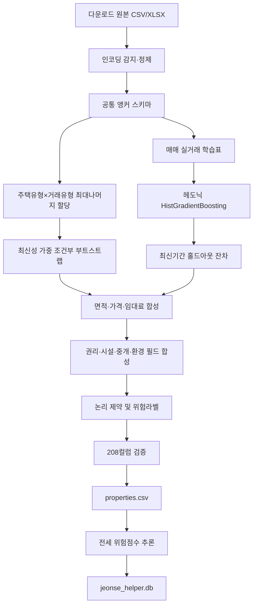

# 실거래 기반 합성 부동산 매물 데이터 생성 백서

> 문서 버전: 1.0  
> 기준일: 2026-07-15  
> 생성기 버전: `multi-source-conditional-bootstrap-v2`  
> 최종 산출물: 20,000행 × 208컬럼  
> 적용 범위: 연구·개발·GUI·Agent·검색 DB 시험용 합성 부동산 매물

---

## 초록

이 백서는 국토교통부 실거래 공개자료, 경기도 부동산 포털 오피스텔 임대자료,
KB 시장지표와 HUG 지역 사고통계를 이용해 한국 부동산 매물 형태의 합성 표 데이터를
생성한 과정과 실험 결과를 기술한다. 목표는 단순히 행 수를 늘리는 것이 아니라 다음
조건을 동시에 만족하는 것이었다.

1. 사용자가 지정한 수와 정확히 같은 수의 레코드를 생성할 것
2. 아파트·오피스텔·단독·다가구·다세대·연립을 모두 포함할 것
3. 각 주택유형에 매매·전세·월세를 모두 포함할 것
4. 실거래의 지역·면적·연식·가격·계약유형 간 관계를 가능한 범위에서 보존할 것
5. 공인중개 매물을 표현하는 풍부한 스키마를 제공할 것
6. 실제 주소·중개사·전화번호를 합성 결과로 오인하지 못하게 할 것
7. 직접 원본이 없는 조합을 직접지원 조합과 구분할 것
8. 생성 과정과 실험을 재현하고 검증할 수 있을 것

최종 방법은 범용 생성형 AI 하나에 모든 컬럼을 맡기는 방식이 아니다. 조건부 경험
부트스트랩, 헤도닉 Gradient Boosting, 시간 홀드아웃 잔차 부트스트랩, 전월세 변환
규칙, 권리관계 합성 규칙과 논리 제약을 결합한 하이브리드 방식이다.

정제 후 생성에 사용 가능한 거래 앵커는 총 709,069행이었다. 최종 데이터는
서울 19,584행, 경기 416행이며 6개 주택유형 × 3개 거래유형의 18개 조합을 모두
포함한다. ML 가격모형의 최신기간 홀드아웃 성능은 `log(㎡당가격)` 기준
R² 0.7552, ㎡당가격 MdAPE 17.68%였다. 최종 논리 검증, 스키마 검증과 통합 테스트는
모두 통과했다.

이 결과는 실제 매물이나 감정평가 데이터가 아니다. 특히 아파트 임대와 다세대·연립은
직접 원본이 없어 교차자료 프록시 방식으로 생성되며, 등기·체납·근저당·시설 상태와
중개사 정보도 합성값이다.

---

## 1. 문제 정의

### 1.1 프로젝트에서 필요했던 데이터

프로젝트는 청년 주거·금융 Agent가 다음 기능을 시험할 수 있는 매물 테이블을
필요로 했다.

- 지역·가격·주택유형·거래유형 조건 검색
- 전세 위험점수 계산
- 청년 자산·소득 대비 주거비 적정성 계산
- 금융지원 제도와 매물 연결
- 안전·생활편의 조건과 매물 결합
- GUI에서 실제 중개 매물과 유사한 상세 정보 표시
- 추천모델과 Text2SQL 도구의 통합 시험

국토교통부 실거래 API는 실제 신고 거래의 핵심 가격·면적·지역은 제공하지만,
현재 매물의 시설·권리·중개사·광고 정보 전체를 제공하지 않는다. 반대로 중개 매물
형태만 무작위 생성하면 실제 시장의 가격과 지역 분포가 사라진다. 따라서 실거래는
가격·입지·구조의 앵커로 사용하고, 실거래에 없는 필드는 도메인 규칙으로 합성해야
했다.

### 1.2 연구 질문

구현과 실험은 다음 질문을 중심으로 진행했다.

| ID | 연구 질문 |
|---|---|
| RQ1 | 원본 행을 그대로 복제하지 않고도 지역·주택유형·면적·가격의 결합을 유지할 수 있는가? |
| RQ2 | 모든 주택유형×거래유형 조합을 사용자가 원하는 비율과 정확한 총개수로 만들 수 있는가? |
| RQ3 | 수동 가격계수보다 ML 헤도닉 가격모형이 구조적 가격관계를 개선하는가? |
| RQ4 | ML 예측이 평균으로 수축해 가격 다양성을 훼손하지 않도록 할 수 있는가? |
| RQ5 | 직접 원본이 없는 조합을 투명하게 프록시 생성하고 식별할 수 있는가? |
| RQ6 | 208개 공인중개형 필드의 논리관계를 자동 검증할 수 있는가? |
| RQ7 | 합성 CSV가 기존 위험모형·검색 DB·Agent 도구에서 정상 작동하는가? |

### 1.3 성공 기준

다음 조건을 최소 성공 기준으로 정했다.

- 요청 행 수와 생성 행 수가 정확히 일치
- 18개 주택유형×거래유형 조합 누락 없음
- canonical schema 누락 없음
- 매매 행의 보증금·월세 0
- 전세 행의 월세 0
- 월세 행의 월세액 양수
- 면적·시장가치·세대수 양수
- 현재층≤총층, 선순위≤세대수
- 합성 주소와 합성 중개사 식별자 사용
- 고유 `property_id`, `listing_id`
- 전세 행에만 합성 사기라벨 생성
- CSV, SQLite 적재 및 통합 테스트 통과

---

## 2. 범위와 비범위

### 2.1 포함 범위

주거용 부동산 6개 유형을 대상으로 한다.

1. 아파트
2. 오피스텔
3. 단독주택
4. 다가구주택
5. 다세대주택
6. 연립주택

거래유형은 매매·전세·월세다. 결과적으로 18개 조합을 생성한다.

### 2.2 포함하지 않은 범위

- 실제 온라인에 게시된 현재 매물
- 실제 상세주소·동호수·소유자·중개사 개인정보
- 실제 등기부·건축물대장·체납 조회 결과
- 감정평가 또는 보증기관의 공식 보증가능 판정
- 실제 전세사기 확정 라벨
- 전국 모든 시군구의 균등한 실거래 대표성
- 상가·사무실·숙박·공장 등 비주거 상업부동산
- 차등프라이버시 또는 재식별 불가능성에 대한 수학적 보장

### 2.3 합성 데이터의 사용 제한

생성 결과는 모델·DB·화면·Agent 동작을 시험하기 위한 연구용이다. 실제 계약 체결,
보증가입 판단, 대출심사, 감정평가, 등기 권리분석이나 투자판단에 사용해서는 안 된다.

---

## 3. 데이터 계보와 선택 원칙

### 3.1 데이터 선택 원칙

다운로드 폴더에 있다는 이유만으로 모든 파일을 생성모형에 넣지 않았다. 데이터는
목표 변수와 의미상 연결되어 있고, 중복 가중이나 미래정보 누수가 없을 때만 사용했다.

가격·면적 생성에 안전시설 수, 편의점 수, 금융상품 정보, CODEF 테스트자료나
전세사기 피해결정 건수를 함께 넣으면 현재 데이터 범위에서는 인과관계가 검증되지
않은 상관을 만들 가능성이 높다. 따라서 기능별 데이터 경계를 유지했다.

### 3.2 실제 사용 데이터

정제 후 내부 공통 스키마로 사용할 수 있었던 원본은 총 709,069행이다.

| 내부 풀 | 정제 후 행 | 기간 | 지역 수 | 역할 |
|---|---:|---|---:|---|
| `sh_rent` | 303,058 | 2024-07~2026-07 | 서울 25개 구 | 단독·다가구 전세/월세 |
| `sh_trade` | 7,484 | 2024-07~2026-07 | 서울 25개 구 | 단독·다가구 매매·대지·연면적 |
| `apt_trade` | 144,651 | 2024-07~2026-06 | 서울 25개 구 | 아파트 매매·전용면적·층·단지 |
| `silv_trade` | 2,442 | 2024-07~2026-06 | 서울 21개 구 | 아파트 분양권전매 꼬리 |
| `offi_rent` | 181,198 | 2024-07~2026-06 | 서울 25개 구 | 오피스텔 전세/월세 |
| `offi_trade` | 24,181 | 2024-07~2026-06 | 서울 25개 구 | 오피스텔 매매 |
| `gyeonggi_offi_rent` | 46,055 | 2011-08~2024-07 | 경기 43개 시군구 | 경기 오피스텔 전세/월세 |
| 합계 | **709,069** | 2011-08~2026-07 | 서울·경기 | 거래·가격 앵커 |

추가로 다음 자료를 제한적으로 사용했다.

- KB 아파트 매매가 대비 전세가율: 아파트 임대 파생 시 최신 지역 비율
- HUG 시군구 사고율: 전세 합성 위험라벨의 지역효과

### 3.3 원본 분포 요약

#### 단독·다가구 임대

- 다가구 188,254행, 단독 114,804행
- 월세 248,310행, 전세 54,748행
- 면적 중앙값 30㎡, 5~95백분위 15~84㎡
- 보증금 중앙값 1,500만원, 95백분위 20,000만원
- 월세 중앙값 45만원, 95백분위 94만원

#### 단독·다가구 매매

- 단독 4,838행, 다가구 2,646행
- 연면적 중앙값 164.45㎡, 5~95백분위 33.06~492.15㎡
- 매매가 중앙값 114,500만원, 5~95백분위 37,075~450,000만원

#### 아파트 매매

- 일반 매매 144,651행
- 전용면적 중앙값 80.11㎡, 5~95백분위 35.11~126.16㎡
- 매매가 중앙값 99,000만원, 5~95백분위 35,000~297,500만원

#### 아파트 분양권전매

- 2,442행
- 면적 중앙값 84.63㎡
- 거래금액 중앙값 133,001.5만원
- 일반 아파트 매매보다 고가 신축 꼬리를 보완하는 용도로만 소량 사용

#### 서울 오피스텔

- 임대 181,198행: 월세 136,573, 전세 44,625
- 임대 면적 중앙값 24.2㎡, 보증금 중앙값 5,000만원, 월세 중앙값 50만원
- 매매 24,181행
- 매매 면적 중앙값 28.8㎡, 매매가 중앙값 23,300만원

#### 경기 오피스텔 임대

- 46,055행: 월세 29,641, 전세 16,414
- 43개 시군구
- 면적 중앙값 28㎡, 보증금 중앙값 3,000만원, 월세 중앙값 42만원

### 3.4 사용하지 않은 데이터와 이유

| 데이터 | 생성기에서 제외한 이유 | 실제 사용 위치 |
|---|---|---|
| CCTV·소방서·치안센터·비상벨 | 가격·계약 원본과 직접 결합키가 없고 허위 상관 위험 | 안전도구 |
| 편의점 API/캐시 | 가격 생성보다 지도·생활편의 조회 목적 | 편의도구 |
| CODEF 테스트자료 | 사용자 금융상태·인증 흐름용 | CODEF 도구 |
| 금융지원 상품 DB | 매물 속성이 아닌 추천 대상 제도 | 금융검색 DB |
| 상업업무용 RTMS | 이번 6개 주거유형 범위 밖 | 향후 상업용 생성기 후보 |
| 전세사기 피해결정 통계 | 개별 매물 가격·권리와 연결되는 직접키 없음 | 지역 설명자료 후보 |
| 주거 설문 대부분 | 실거래와 중복하거나 기준연도가 오래됨 | 보조 검증 후보 |
| 중복 KB 파일 | 동일 지표 중복가중 방지 | `duplicates` 보관 |
| 안전/편의 위치 데이터 | 합성 좌표가 실제 주소가 아니므로 정밀 공간결합이 오히려 오해 유발 | 실주소 서비스 단계 |

데이터를 적게 쓴다는 뜻이 아니라, 각 데이터가 맡는 역할을 분리했다는 뜻이다.

---

## 4. 공통 스키마 설계

### 4.1 설계 목적

공인중개사 실무, 주거용 중개대상물 확인·설명, 표시광고, 기존 프로젝트의 위험·검색·
추천 필드를 합쳐 208개 canonical 컬럼을 정의했다. 특정 민간 포털의 비공개 제휴
스키마 전체를 복제한 것은 아니다.

### 4.2 스키마 그룹

| 그룹 | 그룹 내 선언 수 | 주요 내용 |
|---|---:|---|
| 식별·출처 | 23 | ID, 합성표식, 원본해시, 생성방법, ML 지표 |
| 위치·토지 | 21 | 시도·시군구·동, 법정동코드, 지번·도로, 토지이용 |
| 거래·가격 | 24 | 매매가, 보증금, 월세, 관리비, 계약, 보수 |
| 건축물·호실 | 35 | 용도·구조·연식·층·면적·방·세대·부속공간 |
| 시설·상태 | 30 | 주차·승강기·냉난방·가전·누수·균열·수리 |
| 권리·안전 | 37 | 소유·신탁·압류·체납·근저당·선순위·보증·위험 |
| 환경·접근 | 10 | 교통·학교·마트·병원·공원·소음·침수 |
| 중개·광고 | 20 | 중개사·보증·광고·사진·영상·방문 |
| 설명 근거 | 9 | 등기·대장·지적도·토지이용계획·설명완료 |

그룹 선언 수의 합은 209이지만 `building_total_units`가 의미상 두 그룹에 한 번씩
나타나므로 canonical 리스트에서 순서를 유지한 채 중복 제거한 최종 컬럼은 208개다.

### 4.3 계보 메타데이터

각 행은 다음을 통해 생성경로를 추적할 수 있다.

- `source_dataset`: 기준 원본
- `source_record_hash`: 원본의 직접 식별자를 노출하지 않는 BLAKE2b 해시
- `source_transaction_type`: 원본 거래유형
- `generation_method`: 직접지원 또는 교차자료 프록시
- `price_estimation_method`: 경험가격, ML, 임대환산가치의 조합
- `price_model_name`: 사용한 가격모형
- `price_model_holdout_mdape_pct`, `price_model_holdout_r2`: 모형 검증 성능
- `privacy_distance_score`: 기준행과 합성행의 면적·가격 상대 변화량

### 4.4 직접지원과 프록시의 구분

| 대상 | 매매 | 전세 | 월세 |
|---|---|---|---|
| 아파트 | 직접지원 | 프록시 | 프록시 |
| 오피스텔 | 직접지원 | 직접지원 | 직접지원 |
| 단독주택 | 직접지원 | 직접지원 | 직접지원 |
| 다가구주택 | 직접지원 | 직접지원 | 직접지원 |
| 다세대주택 | 프록시 | 프록시 | 프록시 |
| 연립주택 | 프록시 | 프록시 | 프록시 |

최종 20,000행 중 직접지원은 13,040행(65.2%), 교차자료 프록시는 6,960행(34.8%)이다.

---

## 5. 생성 아키텍처



핵심 설계는 다음 세 층으로 나뉜다.

1. **실증 층**: 실거래의 지역·면적·연식·가격·계약을 앵커로 사용
2. **모형 층**: ML 가격함수와 잔차 부트스트랩으로 구조와 분산 보정
3. **규칙 층**: 거래금액·건축·권리·광고의 논리관계를 강제

---

## 6. 알고리즘 상세

### 6.1 인코딩과 정제

CSV는 UTF-8-SIG, CP949, UTF-8 순으로 읽기를 시도한다. 금액 문자열의 쉼표를
제거하고 만원 단위 숫자로 통일한다.

매매자료에서는 다음을 제외한다.

- `cdealType=O` 또는 `1`인 취소공시
- 0 이하 거래금액
- 비정상 면적
- 시군구 또는 법정동이 없는 행

정제 결과의 예는 다음과 같다.

- 아파트 다운로드 153,493행 중 사용 가능 일반매매 144,651행
- 단독·다가구 매매 다운로드 8,225행 중 사용 가능 7,484행
- 분양권전매 다운로드 2,757행 중 사용 가능 2,442행

### 6.2 조합별 건수 할당

기본 주택유형 가중치:

```text
아파트 0.32, 오피스텔 0.24, 단독 0.12,
다가구 0.18, 다세대 0.09, 연립 0.05
```

기본 거래유형 가중치:

```text
매매 0.35, 전세 0.35, 월세 0.30
```

조합 `h,t`의 기대 건수는 다음과 같다.

```text
expected(h,t) = N × house_weight(h) × transaction_weight(t)
```

기대값을 내림한 뒤 소수점이 큰 조합부터 남는 행을 배분하는 최대나머지 방식으로
정확히 `N`행을 맞춘다. `N≥18`이면 각 조합을 최소 1행 보장한다.

### 6.3 최신성 가중 조건부 부트스트랩

각 원본 행의 거래월이 최신월에서 `age`개월 전일 때 가중치는 다음과 같다.

```text
w = exp(-log(2) × age / half_life_months)
```

기본 반감기는 18개월이다. 범주별 주변분포를 따로 뽑지 않고 원본 행 전체를 함께
뽑기 때문에 지역·면적·연식·거래금액·계약형태의 관측 결합을 유지한다.

### 6.4 면적 합성

```text
직접지원 면적 = 기준면적 × LogNormal(0, 0.025)
프록시 면적   = 기준면적 × LogNormal(0, 0.060)
```

프록시는 직접 원본이 없기 때문에 더 큰 변동을 허용한다. 유형별 허용범위도 적용한다.

- 오피스텔 10~180㎡
- 다세대·연립 15~250㎡
- 전체 절대범위 10~1,500㎡

### 6.5 헤도닉 ML 가격모형

#### 학습표

아파트 매매, 오피스텔 매매, 단독·다가구 매매를 사용한다. 계산비용과 유형불균형을
조절하기 위해 최대 표본은 아파트 60,000, 오피스텔 30,000, 단독·다가구 20,000행이다.

#### 입력과 목표

```text
입력 X = log(면적), 건축연령, 층, 거래월, 시군구, 원본 주택유형
목표 y = log(매매가 / 면적)
```

시군구와 주택유형은 최소빈도 30의 One-Hot Encoding을 사용한다. 미관측 범주는
오류를 내지 않고 알려지지 않은 범주로 처리한다.

#### 모형

`HistGradientBoostingRegressor` 설정:

| 파라미터 | 값 |
|---|---:|
| loss | squared error |
| learning rate | 0.07 |
| max iterations | 140 |
| max leaf nodes | 31 |
| min samples leaf | 40 |
| L2 regularization | 0.15 |

#### 시간 홀드아웃

각 원본 주택유형에서 최신 약 15% 거래월을 검증용으로 제외한다. 임의분할보다 실제
운영에서 필요한 “과거 관계로 더 최근 가격을 설명하는 능력”에 가까운 평가다.

#### 잔차 부트스트랩

예측가격만 생성하면 분산이 줄어드는 평균회귀 문제가 생긴다. 따라서 홀드아웃에서
다음을 계산한다.

```text
residual = actual log(㎡당가격) - predicted log(㎡당가격)
```

생성할 때 주택유형별 잔차 경험분포에서 복원추출해 예측 로그가격에 더한다. 단일
극단 잔차가 비현실적인 매물을 만들지 않도록 전체 잔차의 0.5~99.5백분위로 제한한다.

#### 직접매매 가격 혼합

직접 매매 원본은 지역 실제값을 대부분 유지한다.

```text
empirical = 원본매매가 × (합성면적/원본면적)^0.82 × 유형계수 × 작은 로그잡음
final_log_price = 0.70 × log(empirical) + 0.30 × log(ML+residual)
```

프록시와 임대의 시장가치 앵커는 ML+잔차 결과를 더 적극적으로 사용한다.

### 6.6 아파트·다세대·연립 프록시

현재 직접 아파트 임대, 다세대, 연립 RTMS가 없다.

- 아파트 전세·월세: 아파트 매매의 위치·면적·연식에 ML 시장가격과 최신 KB
  지역 전세가율을 결합
- 다세대: 아파트 구분소유 호실을 구조 앵커로 쓰고 가격계수 0.58 적용
- 연립: 아파트 구분소유 호실을 구조 앵커로 쓰고 가격계수 0.66 적용

0.58과 0.66은 별도 회귀로 추정된 시장 구조모수가 아니라 보수적 생성계수다. 따라서
`generation_method=교차자료 조건부 프록시`로 반드시 표시한다.

### 6.7 전세·월세 생성

#### 직접 임대 원본

보증금을 작은 로그잡음으로 움직이고 그 차이를 전월세전환율로 월세에 반영한다.

```text
conversion_rate ~ clipped Normal(0.055, 0.009), 범위 3~9%
monthly' = source_monthly
         + (source_deposit - synthetic_deposit) × conversion_rate / 12
```

#### 매매 원본에서 임대 파생

```text
equivalent_deposit = market_value × jeonse_ratio
```

- 전세: 환산보증금을 전세보증금으로 사용하고 월세 0
- 월세: Beta 분포로 보증금 비중을 정하고 나머지를 전환율로 월세화
- 아파트: 최신 KB 지역별 매매가 대비 전세가율 우선
- 기타 유형: 유형별 기준 전세가율+정규 잡음, 32~85% 제한

### 6.8 건물과 호실

주택유형별로 다른 세대수·층수 분포를 사용한다.

- 아파트: 60~1,200세대, 5~49층
- 오피스텔: 20~500실, 5~34층
- 단독: 주로 1세대, 1~3층
- 다가구: 3~30호, 2~6층
- 다세대: 6~50세대, 3~7층
- 연립: 4~30세대, 3~6층

방 수는 면적에 조건부이며, 주차·승강기·관리비·냉난방·보안시설도 유형·면적·층수와
연결된다.

### 6.9 권리관계와 전세 위험

실거래 API에 없는 근저당·선순위 임차인·체납·신탁·위반건축물은 조건부 합성이다.
다가구 임대만 한 건물에 여러 임차인이 있는 구조로 취급하며, 아파트·오피스텔·
다세대·연립은 구분소유 호실로 취급한다.

전세 위험라벨은 다음 구조를 따른다.

```text
logit(p) = -4.25
         + 3.2 × max(경매회수 대비 부채비율 - 0.82, 0)
         + 1.0 × 후순위 비율
         + 1.4 × max(전세가율 - 0.78, 0)
         + 0.7 × HUG 지역 사고율 효과
         + 0.75 × 문서위험 개수
         + random noise
```

이는 실제 사기 확정라벨이 아니라 위험 신호를 가진 합성 정답이다.

### 6.10 식별자와 개인정보 대체

- 실제 건물명 대신 `합성 {동} {주택유형} {일련번호}`
- 실제 도로·지번 대신 `합성로`, `합성지번`
- 실제 중개사 대신 `합성 ... 공인중개사사무소`
- 등록번호는 `SYN-` 접두사
- 전화번호는 `000-0000-xxxx`
- 상세 호수는 비공개 합성 문구
- 원본 연결은 단방향 해시만 보존

---

## 7. 실험 설계와 수행 이력

### 7.1 실험 단계 개요

| 실험 | 목적 | 규모 | 핵심 결과 |
|---|---|---:|---|
| E0 | 기존 생성기 한계 확인 | 기존 5,000행 | 단독·다가구 임대 중심, 167컬럼 |
| E1 | 원본 정규화 | 7개 풀, 709,069행 | 취소·오류 제거, 공통 앵커 확립 |
| E2 | 최소 조합 커버리지 | 18행 | 18개 조합 각각 1행 생성 |
| E3 | 비ML smoke test | 180행 | 6유형·3거래, 27지역, 205컬럼 |
| E4 | 비ML 전체 생성 | 20,000행 | 18개 조합·60지역, DB 적재 |
| E5 | ML smoke test | 180행 | 208컬럼, R² 0.7562, MdAPE 17.45% |
| E6 | ML/비ML A/B | 각 3,000행 | 구조상관 개선, 분산 96.8% 유지 |
| E7 | ML 전체 생성 | 20,000행 | R² 0.7552, MdAPE 17.68% |
| E8 | 원본-합성 충실도 | 직접지원 10조합 | KS·TVD 측정 |
| E9 | 논리 제약 감사 | 최종 20,000행 | 월세 0원 10건 발견·수정 후 0건 |
| E10 | 전세 위험구조 | 전세 7,000행 | 고부채군 양성률 방향 확인 |
| E11 | 계보·비식별 | 최종 20,000행 | 앵커 재사용·변형거리·식별표식 감사 |
| E12 | 결측 패턴 | 208컬럼 | 구조적 결측과 DB 후처리 구분 |
| E13 | DB·Agent 통합 | DB 20,000행 | 전세 7,000건 점수화, 테스트 통과 |

### 7.2 E0: 기존 생성기 한계 확인

초기 생성기는 단독·다가구 전월세와 매매를 결합한 임대 매물 생성기였다. 장점은
다가구 권리관계와 전세위험을 상세히 표현한 것이었지만 다음 한계가 있었다.

- 아파트·오피스텔·다세대·연립 미포함
- 매매 매물 미생성
- 전세·월세만 허용하는 검증 규칙
- 다운로드한 신규 원본이 생성기로 연결되지 않음
- 가격함수가 수동 면적탄력도와 로그잡음 중심
- 공인중개형 스키마가 167컬럼에 머무름

이 분석을 통해 기존 함수를 무리하게 분기하는 대신 다중원본 통합 생성기를 별도
구현하고 기존 entry point에서 호환 호출하도록 결정했다.

### 7.3 E1: 원본 정규화 실험

원본별 컬럼과 단위가 달랐다.

- 단독·다가구 임대: `totalFloorAr`, `deposit`, `monthlyRent`
- 아파트: `excluUseAr`, `aptNm`, `floor`, `dealAmount`
- 오피스텔: `excluUseAr`, `offiNm`, `floor`
- 경기 포털: 한글 컬럼과 CP949 인코딩
- 매매 취소행: `cdealType=O`

공통 앵커를 만들고 정제한 뒤 모든 풀이 비어 있지 않은지 검사했다. PowerShell
콘솔의 CP949 표시 문제와 파일 자체 인코딩을 구분하기 위해 CSV 로더는 여러 인코딩을
순차 시도하도록 했다.

### 7.4 E2: 최소 18행 커버리지 실험

요청 수가 조합 수와 같은 18일 때 각 조합이 정확히 한 번 생성되는지 확인했다.

- 주택유형별 3행
- 거래유형별 6행
- 총 18개 조합
- 검증 오류 없음

이 실험은 최대나머지 할당과 최소 1행 보장 로직의 경계조건을 확인했다.

### 7.5 E3: 180행 비ML smoke test

ML 도입 전 180행을 생성했다.

- 180행 × 205컬럼
- 아파트 57, 오피스텔 43, 다가구 32, 단독 22, 다세대 17, 연립 9
- 매매 63, 전세 63, 월세 54
- 서울·경기 27개 지역
- canonical schema 및 금액 제약 통과

이때 기존 테스트가 `모든 행의 보증금>0`을 가정해 매매의 정상적인 보증금 0을
실패로 처리했다. 테스트를 임대 행만 보증금 양수, 매매는 보증금 0으로 수정했다.

### 7.6 E4: 비ML 20,000행 생성

조건부 경험 부트스트랩만으로 20,000행을 생성하고 DB 적재를 확인했다.

- 20,000행 × 205컬럼
- 18개 조합
- 60개 지역
- SQLite 20,000행 적재
- 전세 7,000행 위험점수 계산

이 단계는 대용량 생성과 서비스 호환성을 확인했지만, 프록시 가격이 수동 계수에
과도하게 의존한다는 한계가 남았다.

### 7.7 E5: ML smoke test

헤도닉 GBDT와 잔차 부트스트랩을 추가한 뒤 180행을 생성했다.

- 180행 × 208컬럼
- 최신기간 홀드아웃 R² 0.7562
- MdAPE 17.45%
- 스키마·금액 검증 오류 0
- 가격방법이 세 종류로 명시됨
  - 직접 실거래+헤도닉 혼합
  - 임대 환산가치+헤도닉
  - 헤도닉+잔차×유형별 전세가율

### 7.8 E6: 동일 시드 3,000행 ML/비ML A/B

시드 2026, 동일 가중치와 동일 요청 수로 비교했다.

| 지표 | 비ML | ML+잔차 | 해석 |
|---|---:|---:|---|
| 전체 매매 log가격 표준편차 | 0.9486 | 0.9178 | ML이 비ML 분산의 96.8% 유지 |
| 아파트 면적-log가격 상관 | 0.7211 | 0.7470 | 구조관계 개선 |
| 오피스텔 면적-log가격 상관 | 0.7702 | 0.8006 | 구조관계 개선 |
| 다가구 면적-log가격 상관 | 0.6051 | 0.6688 | 구조관계 개선 |
| 단독 면적-log가격 상관 | 0.6017 | 0.6513 | 구조관계 개선 |
| 연립 면적-log가격 상관 | 0.6702 | 0.7141 | 구조관계 개선 |
| 다세대 면적-log가격 상관 | 0.5556 | 0.5407 | 소폭 하락, 직접원본 부재 영향 |

ML은 직접원본이 있는 주요 유형에서 면적과 가격의 관계를 강화했다. 전체 가격분산은
약간 줄었지만 잔차 부트스트랩으로 대부분 유지했다. 다세대는 아파트 프록시와 가격
계수를 사용하므로 개선이 보장되지 않았고 실제로 소폭 낮아졌다. 이 결과는 다세대
직접 실거래 원본이 필요하다는 근거다.

### 7.9 E7: 최종 ML 20,000행 생성

시드 42로 생성했다.

#### 주택유형별 건수

| 유형 | 건수 | 비율 |
|---|---:|---:|
| 아파트 | 6,400 | 32% |
| 오피스텔 | 4,800 | 24% |
| 다가구 | 3,600 | 18% |
| 단독 | 2,400 | 12% |
| 다세대 | 1,800 | 9% |
| 연립 | 1,000 | 5% |

#### 거래유형별 건수

| 유형 | 건수 | 비율 |
|---|---:|---:|
| 매매 | 7,000 | 35% |
| 전세 | 7,000 | 35% |
| 월세 | 6,000 | 30% |

#### 18개 조합

| 주택유형 | 매매 | 전세 | 월세 | 합계 |
|---|---:|---:|---:|---:|
| 아파트 | 2,240 | 2,240 | 1,920 | 6,400 |
| 오피스텔 | 1,680 | 1,680 | 1,440 | 4,800 |
| 단독주택 | 840 | 840 | 720 | 2,400 |
| 다가구주택 | 1,260 | 1,260 | 1,080 | 3,600 |
| 다세대주택 | 630 | 630 | 540 | 1,800 |
| 연립주택 | 350 | 350 | 300 | 1,000 |
| 합계 | 7,000 | 7,000 | 6,000 | 20,000 |

#### 지역

- 서울 19,584행, 97.92%
- 경기 416행, 2.08%
- 서로 다른 `(시도, 시군구)` 60개
- 시군구 엔트로피 4.7136 bits
- 엔트로피의 유효지역수 `2^H`는 약 26.2개

60개 지역이 존재하지만 서울 원본이 압도적으로 많아 균등한 전국분포는 아니다.

#### 가격모형

- 홀드아웃 R²: 0.755193
- 홀드아웃 MdAPE: 17.6807%
- 모형: `HistGradientBoosting+holdout-residual-bootstrap`

### 7.10 E8: 원본-합성 직접지원 충실도

KS는 연속분포의 최대 누적분포 차이, TVD는 범주분포 차이다. 둘 다 0에 가까울수록
비슷하지만, 이 생성기는 최신성 가중·잡음·가격모형·목표 가중치를 의도적으로
적용하므로 보편적인 합격 임계값으로 사용하지 않았다.

| 조합 | 면적 KS | 지역 TVD | 금액 KS | 해석 |
|---|---:|---:|---:|---|
| 다가구 매매 | 0.0273 | 0.0626 | 매매가 0.0294 | 높은 충실도 |
| 다가구 월세 | 0.0317 | 0.0510 | 보증금 0.1466, 월세 0.0479 | 보증금 이동곡선 영향 |
| 다가구 전세 | 0.0324 | 0.0532 | 보증금 0.0349 | 높은 충실도 |
| 단독 매매 | 0.0337 | 0.0438 | 매매가 0.0405 | 높은 충실도 |
| 단독 월세 | 0.0575 | 0.0602 | 보증금 0.1519, 월세 0.0742 | 보증금 이동곡선 영향 |
| 단독 전세 | 0.0347 | 0.0643 | 보증금 0.0628 | 양호 |
| 아파트 매매 | 0.1541 | 0.0383 | 매매가 0.0348 | 면적 차이 상대적으로 큼 |
| 오피스텔 매매 | 0.0280 | 0.0420 | 매매가 0.0230 | 높은 충실도 |
| 오피스텔 월세 | 0.0212 | 0.0953 | 보증금 0.1782, 월세 0.0295 | 서울·경기 혼합+보증금 이동 |
| 오피스텔 전세 | 0.0249 | 0.1177 | 보증금 0.0447 | 경기 혼합으로 지역 TVD 증가 |

아파트 면적 KS 0.1541이 다른 직접지원 조합보다 높은 이유는 일반매매와 분양권전매를
혼합하고, 최신성 가중과 목표 조합 가중치를 사용했기 때문이다. 반면 매매가 KS는
0.0348로 낮았다. 월세 보증금 KS가 0.15~0.18인 것은 보증금을 단순 복사하지 않고
전환율 곡선 위에서 이동시키는 설계의 결과이며, 월세액 KS는 0.03~0.07 수준이었다.

이 실험은 주변분포만 확인한다. 지역×면적×연식×가격의 전체 고차원 결합을 완전히
검증한 것은 아니다.

### 7.11 E9: 논리 제약 감사와 결함 수정

최초 감사에서 월세 6,000행 중 10행이 `monthly_rent_manwon=0`이었다. 원본 월세를
보증금 이동으로 보정한 뒤 1만원 단위로 반올림하면서 0.5만원 미만 값이 0이 된
경계조건이었다.

수정:

```text
if transaction_type == 월세:
    monthly_rent_manwon = max(monthly_rent_manwon, 1)
```

검증기에도 월세 양수 규칙을 추가하고 최종 20,000행과 DB를 재생성했다.

#### 수정 후 위반 건수

| 제약 | 위반 |
|---|---:|
| 매매인데 보증금/월세 존재 | 0 |
| 전세인데 월세 존재 | 0 |
| 월세인데 월세액≤0 | 0 |
| 현재층>총층 | 0 |
| 내 순위>총세대수 | 0 |
| 공급면적<전용면적 | 0 |
| 계약면적<전용면적 | 0 |
| 시장가치≤0 | 0 |
| 중복 property ID | 0 |
| 중복 listing ID | 0 |

실험에서 발견된 실패를 숨기지 않고 회귀 검증으로 고정한 사례다.

### 7.12 E10: 전세 위험구조 검증

최종 전세 7,000행의 합성 라벨 양성률은 3.9571%다.

경매회수율 80% 기준 부채비율을 계산했을 때:

- 고부채(`debt_ratio>1`) 1,499행
- 고부채 양성률 8.6057%
- 저부채 양성률 2.6904%
- 고부채 양성률은 저부채의 약 3.20배

단순 Pearson 상관은 0.0167로 낮다. 라벨이 부채만이 아니라 후순위·전세가율·지역·
문서위험과 무작위성을 함께 포함하는 이진 표본이기 때문이다. 고/저 위험군의 조건부
양성률 차이가 의도한 방향인지가 더 직접적인 검증이다.

### 7.13 E11: 계보·재사용·비식별 점검

#### 앵커 재사용

- 합성행 20,000
- 서로 다른 원본 앵커 해시 19,226
- 원본 앵커 재사용이 발생한 행 비율 3.87%
- 한 앵커 최대 사용 5회
- 앵커별 사용횟수 중앙값 1회

복원추출이므로 원본 앵커 재사용은 허용된다. 같은 앵커를 사용해도 연속값 잡음,
시설·권리·중개정보가 달라 동일 합성행이 되지는 않는다.

#### 변형거리

- 최소 0.001
- 5백분위 0.037
- 중앙값 0.090
- 95백분위 0.604
- 최대 1.204
- 정확히 0인 행 0

#### 식별표식

- 모든 도로주소에 `합성` 포함
- 모든 중개사 등록번호가 `SYN-`으로 시작
- 고유 매물·광고 ID
- 실제 상세호수 미출력

이는 실무적 비식별 조치이지 차등프라이버시나 멤버십 추론 방어를 보장하지 않는다.

### 7.14 E12: 결측 패턴 확인

결측은 대부분 거래유형에 따른 구조적 결측이다.

| 컬럼 | CSV 결측률 | 이유 |
|---|---:|---|
| `fraud_score` | 100% | CSV 생성 후 DB 구축 단계에서 기존 모델로 채움 |
| `fraud_label` | 65% | 전세 35%에만 합성 정답 생성 |
| `base_rent_record_hash` | 64.9% | 임대 원본 앵커를 쓴 행에만 존재 |
| `base_trade_record_hash` | 35.1% | 매매 원본 앵커를 쓴 행에만 존재 |

`fraud_score`는 SQLite에서 전세 7,000행 모두 계산되어 있다. CSV와 DB는 생성
파이프라인 단계가 다르므로 이 차이를 문서화해야 한다.

### 7.15 E13: DB·Agent 통합 시험

DB 재구축 결과:

- `properties`: 20,000행
- 전세 `fraud_score` 비결측: 7,000행
- `finance_programs`: 5행
- `region_accident_stats`: 252행

통과한 통합 시험:

- 지도도구 fallback
- Text2SQL 안전검사와 매물질의
- 금융서비스 검색
- Agent 조건확인과 2단계 대화
- 출퇴근·안전·편의점 도구 연결
- SafeMap 편의점 API 캐시
- CODEF 테스트 fallback
- 계약·권리 자문도구
- 데이터 증강 현실성·스키마·위험방향 검증

---

## 8. 최종 데이터 통계

### 8.1 전체 연속값

0이 구조적으로 정상인 매매 보증금·임대 매매가 등은 제외하고 양수값을 요약했다.

| 변수 | 최소 | 중앙값 | 95백분위 | 최대 |
|---|---:|---:|---:|---:|
| 면적(㎡) | 10.0 | 58.05 | 194.31 | 1,488.40 |
| 매매가(만원) | 5,800 | 75,600 | 294,645 | 1,457,500 |
| 보증금(만원) | 10 | 15,385 | 80,631.5 | 394,440 |
| 월세(만원) | 1 | 78 | 333.55 | 1,855 |
| 시장가치(만원) | 5,000 | 70,200 | 516,515 | 4,069,900 |

다가구 임대의 `market_price_manwon`은 호실 하나가 아니라 건물 전체가치 성격이므로
다른 구분소유 유형보다 높게 나타날 수 있다.

### 8.2 조합별 중앙값

| 주택유형 | 거래 | N | 면적㎡ | 시장가치 | 매매가 | 보증금 | 월세 |
|---|---|---:|---:|---:|---:|---:|---:|
| 다가구 | 매매 | 1,260 | 201.06 | 116,400 | 116,400 | - | - |
| 다가구 | 전세 | 1,260 | 40.41 | 411,150 | - | 13,350 | - |
| 다가구 | 월세 | 1,080 | 31.89 | 411,150 | - | 1,020 | 51 |
| 다세대 | 매매 | 630 | 75.36 | 55,350 | 55,350 | - | - |
| 다세대 | 전세 | 630 | 73.72 | 58,100 | - | 36,055 | - |
| 다세대 | 월세 | 540 | 69.44 | 55,150 | - | 8,865 | 111 |
| 단독 | 매매 | 840 | 131.50 | 104,200 | 104,200 | - | - |
| 단독 | 전세 | 840 | 37.28 | 31,550 | - | 12,740 | - |
| 단독 | 월세 | 720 | 21.18 | 29,300 | - | 980 | 48 |
| 아파트 | 매매 | 2,240 | 78.50 | 96,700 | 96,700 | - | - |
| 아파트 | 전세 | 2,240 | 76.68 | 100,100 | - | 53,820 | - |
| 아파트 | 월세 | 1,920 | 75.94 | 95,850 | - | 13,380 | 166 |
| 연립 | 매매 | 350 | 74.85 | 64,850 | 64,850 | - | - |
| 연립 | 전세 | 350 | 78.66 | 64,700 | - | 41,360 | - |
| 연립 | 월세 | 300 | 72.69 | 65,100 | - | 9,490 | 120.5 |
| 오피스텔 | 매매 | 1,680 | 28.96 | 23,750 | 23,750 | - | - |
| 오피스텔 | 전세 | 1,680 | 28.52 | 32,300 | - | 22,320 | - |
| 오피스텔 | 월세 | 1,440 | 23.97 | 24,900 | - | 1,930 | 64 |

### 8.3 최종 원본 사용 건수

| 원본 | 합성행에서 기준으로 사용된 횟수 |
|---|---:|
| 아파트 일반매매 | 9,154 |
| 단독·다가구 임대 | 3,900 |
| 서울 오피스텔 임대 | 2,704 |
| 단독·다가구 매매 | 2,100 |
| 오피스텔 매매 | 1,680 |
| 경기 오피스텔 임대 | 416 |
| 아파트 분양권전매 | 46 |

아파트 매매 원본 사용량이 큰 이유는 아파트 자체뿐 아니라 직접 원본이 없는 다세대·
연립과 아파트 임대의 구조·가격 앵커로도 쓰이기 때문이다.

---

## 9. 머신러닝을 전체 생성에 사용하지 않은 이유

### 9.1 초기 비ML 접근의 이유

초기에는 ML을 사용하지 않았다.

1. 주택유형별 원본 스키마가 달랐다.
2. 아파트 임대·다세대·연립의 정답 원본이 없었다.
3. 권리·시설·중개정보는 학습할 실제 라벨이 없었다.
4. 가격 예측값만 사용하면 분산이 축소될 수 있었다.
5. 생성경로를 설명하고 디버깅하기 어려워질 수 있었다.
6. 모든 18개 조합을 보장하는 것은 예측모형보다 할당·규칙 문제였다.

### 9.2 최종 하이브리드 선택

매매 실거래가 충분한 부분에서는 ML이 수동 가격계수보다 유용했다. 따라서 ML은
`시장가치 중심값`에만 사용하고 다음은 명시적 통계·규칙으로 유지했다.

- 주택·거래 조합 건수
- 지역·계약 앵커 선택
- 전월세 전환
- 시설·권리·중개정보 생성
- 거래별 금액 제약
- 스키마와 비식별 표식
- 위험라벨 구조

이 분리는 ML이 잘하는 비선형 가격함수와 사람이 명시해야 하는 논리규칙을 구분한다.

### 9.3 GAN/TVAE를 기본으로 쓰지 않은 이유

- 직접 원본이 없는 조합의 정확성을 GAN이 해결해주지 않는다.
- 희소 범주를 학습하더라도 모든 조합의 정확한 건수 보장은 별도 로직이 필요하다.
- 법적·업무적 논리제약 위반 가능성이 있다.
- 모델 붕괴와 꼬리분포 손실을 별도 평가해야 한다.
- 원본과 합성의 최근접거리·멤버십 추론 평가가 추가로 필요하다.
- 현재 목표는 GPU 학습보다 CPU 재현성과 행별 계보가 우선이다.

CTGAN의 범주조건부 학습 문제의식은 조합별 할당과 조건부 표본에 반영했지만 CTGAN
자체는 학습하지 않았다.

---

## 10. 연구 근거

### 10.1 Reiter (2005), CART 기반 합성 마이크로데이터

혼합형 표 데이터를 독립적으로 흔들기보다 조건부 분포에 따라 생성해야 결합관계를
보존할 수 있다는 원칙을 반영했다.

- <https://www.scb.se/contentassets/ca21efb41fee47d293bbee5bf7be7fb3/using-cart-to-generate-partially-synthetic-public-use-microdata.pdf>

### 10.2 Reiter (2005), 완전 합성 공개 마이크로데이터

합성모형, 통계적 유용성과 공개위험을 함께 명시해야 한다는 원칙을 계보·변형거리·
비식별 표식에 반영했다.

- <https://doi.org/10.1111/j.1467-985X.2004.00343.x>

### 10.3 Xu et al. (2019), CTGAN

표 데이터의 다봉 연속분포와 불균형 범주 문제를 참고해 전역 단일 정규분포 대신
조합별 경험행과 로그잡음을 사용했다.

- <https://arxiv.org/abs/1907.00503>

### 10.4 Yang et al. (2024), Structured Evaluation

합성 데이터 평가를 단일 주변분포로 끝내지 않고 구조·유용성·모형 관점으로 나눠야
한다는 점을 품질 보고서와 본 백서의 다층 평가에 반영했다.

- <https://arxiv.org/abs/2403.10424>

### 10.5 Bajari and Kahn (2003/2005), 헤도닉 주택가격

주택을 면적·입지·품질 속성 묶음으로 보고 가격함수로 다루는 관점을 ML 특징 설계에
반영했다.

- <https://www.nber.org/papers/w9891>

### 10.6 Park and Bae (2015), 주택가격 ML

MLS 주택 특성과 가격의 관계를 ML과 교차검증으로 평가하는 방법을 참고했다.

- <https://doi.org/10.1016/j.eswa.2014.11.040>

### 10.7 Friedman (2001), Gradient Boosting Machine

비선형 회귀나무 앙상블의 이론적 근거다. 구현에서는 scikit-learn의
HistGradientBoosting을 사용했다.

- <https://doi.org/10.1214/aos/1013203451>

### 10.8 Freedman (1981), Regression Bootstrap

홀드아웃 회귀잔차를 재표본화해 예측분산을 복원하는 근거로 적용했다.

- <https://doi.org/10.1214/aos/1176345638>

### 10.9 Umesh et al. (2024), 논리·함수 의존성 보존

범용 표 합성모형이 논리적·함수적 의존성을 완전히 보존하지 못할 수 있다는 결과를
고려해 업무규칙을 생성모형 외부에서 강제했다.

- <https://arxiv.org/abs/2409.17684>

### 10.10 Little, Allmendinger and Elliot (2025)

합성 마이크로데이터의 유용성과 공개위험 교환관계를 함께 평가해야 한다는 점을
참고했다.

- <https://doi.org/10.1177/0282423X241266523>

---

## 11. 한계와 위험

### 11.1 직접 원본 부재

아파트 임대·다세대·연립은 프록시다. 현재 가장 큰 한계다. 다세대 A/B 실험에서
면적-가격 상관이 ML 적용 후 소폭 하락한 것도 직접 원본 부재와 관련이 있다.

### 11.2 지역 편향

최종 데이터의 97.92%가 서울이다. 경기 416행도 오피스텔 임대에서만 직접 나온다.
전국 데이터처럼 사용하면 안 된다.

### 11.3 목표 비율은 시장점유율이 아니다

32/24/12/18/9/5와 35/35/30은 개발용 다양성 비율이다. 실제 시장 재고나 거래량의
대표 비율로 추정한 값이 아니다. CLI로 변경 가능하다.

### 11.4 합성 권리·시설

근저당·체납·신탁·누수·주차·엘리베이터·중개사 정보는 실측이 아니다. 실제 문서나
현장조사를 대체하지 않는다.

### 11.5 가격모형의 한계

- R² 0.755는 유용하지만 완전한 감정평가 성능이 아니다.
- MdAPE 17.68%는 중앙 기준이며 고가 꼬리오차를 숨길 수 있다.
- 검증은 시간 홀드아웃이지만 독립 외부 데이터셋 검증은 아니다.
- 금리·학군·교통·정비사업·실제 건물상태 등 누락변수가 있다.
- 다세대·연립은 프록시 유형이므로 홀드아웃 성능의 직접 적용 대상이 아니다.

### 11.6 프라이버시 한계

실제 식별자를 출력하지 않고 값을 변형했지만 다음을 아직 수행하지 않았다.

- 멤버십 추론 공격
- 속성 추론 공격
- 최근접 레코드 공개위험 분석
- 차등프라이버시 예산 계산
- 실제 개인·중개사 비공개 원본에 대한 법적 검토

원본 RTMS는 공개 거래자료지만 합성이라는 이름만으로 자동적인 프라이버시 보장이
생기는 것은 아니다.

### 11.7 KS/TVD의 한계

개별 변수와 지역 주변분포만 비교한다. 고차원 결합, 다운스트림 학습 유용성, 꼬리
의존성과 희소 지역의 품질은 추가 평가가 필요하다.

### 11.8 합성 위험라벨의 한계

위험라벨은 설계한 공식에서 나온다. 이 라벨로 학습한 모델의 성능은 공식을 얼마나
재현하는지를 보여줄 뿐 실제 사기를 얼마나 예측하는지 증명하지 않는다.

---

## 12. 재현 방법

### 12.1 실행환경

최종 검증환경:

```text
Windows / PowerShell
Python 3.13.1
numpy 2.4.6
pandas 2.2.3
scipy 1.18.0
scikit-learn 1.8.0
```

### 12.2 기본 재현 명령

```powershell
cd D:\연구\FlexML\kb\jeonse_helper

# 최종 백서 기준 데이터
py -3 -m src.data_augmentation.generate `
  --count 20000 `
  --n-users 2000 `
  --price-model hedonic `
  --seed 42

# 검색 DB와 전세 위험점수
py -3 -m src.db.build_db

# 검증
$env:PYTHONUTF8='1'
py -3 -m tests.test_data_augmentation
py -3 -m tests.test_integration
```

### 12.3 비ML 기준선

```powershell
py -3 -m src.data_augmentation.generate `
  --count 20000 `
  --n-users 0 `
  --price-model none `
  --seed 42
```

### 12.4 사용자 정의 비율

```powershell
py -3 -m src.data_augmentation.generate `
  --count 50000 `
  --house-weights "아파트=0.4,오피스텔=0.2,단독주택=0.1,다가구주택=0.15,다세대주택=0.1,연립주택=0.05" `
  --transaction-weights "매매=0.3,전세=0.4,월세=0.3" `
  --seed 123
```

### 12.5 최종 산출물

| 파일 | 크기(byte) | 역할 |
|---|---:|---|
| `data/generated/properties.csv` | 51,508,784 | 20,000행 합성 매물 |
| `data/generated/property_generation_quality.json` | 2,615 | 품질·분포 보고서 |
| `data/generated/jeonse_helper.db` | 83,120,128 | 검색·Agent SQLite DB |
| `src/data_augmentation/universal_generate.py` | 66,437 | 생성기 구현 |

### 12.6 SHA-256

최종 월세 경계조건 수정 후 기준이다.

```text
universal_generate.py
040D0156B60C9A902E6BB2DF76481BB54B72639C64AA9DB4C2F98105E1FE0811

properties.csv
EAD0AEAB098F7E3EE375E8BF4D15959EE9C18CC068F1F8ECFB8F514A4FBF2FF7

property_generation_quality.json
B192BCE2E35476E46C4B33446D07B32B0CF8404B71ABD9FF55C908AC58AE248E

jeonse_helper.db
881E456DEDDC36C89B23F49FB067C957FB06B5A73EBFB42FD5D9C6729957C48D
```

주의: 위 해시는 문서 작성 시점에 조회한 값이다. 이후 같은 시드로 재생성해도
`generated_at`과 파일 직렬화 시점 때문에 파일 전체 해시는 달라질 수 있다.

---

## 13. 운영 시 권장사항

### 13.1 개발·GUI 시험

현재 20,000행을 그대로 사용한다. 조회속도가 중요하면 CSV보다 SQLite를 사용한다.

### 13.2 추천모델 시험

직접지원과 프록시를 분리해 성능을 보고한다. 프록시만으로 좋아진 성능을 실제시장
일반화로 해석하지 않는다.

### 13.3 전세 위험모델 시험

`fraud_label`은 합성 공식 검증용이고 `fraud_score`는 기존 모델의 출력이다. 실제
사고·보증대위변제·피해결정 라벨이 확보되면 별도 외부검증을 해야 한다.

### 13.4 데이터 갱신

원본 RTMS 월이 추가되면 다운로드 → 생성 → DB 구축 → 테스트 순서로 전체 파이프라인을
다시 실행한다. 최신성 반감기 때문에 신규 거래가 자동으로 더 높은 표본가중치를 갖는다.

### 13.5 모델 변경

ML 하이퍼파라미터를 바꾸면 다음을 최소 비교한다.

- 시간 홀드아웃 R²·MdAPE
- 유형별 가격분산
- 면적-가격 상관
- 직접지원 KS/TVD
- 극단가격 비율
- 18개 조합 논리 제약
- DB·Agent 통합 테스트

---

## 14. 향후 실험 로드맵

### 우선순위 1: 직접 원본 확장

1. 아파트 전월세 RTMS 추가
2. 연립·다세대 매매 RTMS 추가
3. 연립·다세대 전월세 RTMS 추가
4. 가능하면 전국 시군구 자료 추가

직접 원본이 들어오면 프록시 분기를 직접지원으로 교체하고 동일 A/B 실험을 반복한다.

### 우선순위 2: 더 엄격한 충실도 평가

- 1D KS와 범주 TVD
- 지역×유형 조건부 Wasserstein distance
- 상관행렬·상호정보량 차이
- 꼬리 분위수와 극단값 비율
- Train Synthetic Test Real(TSTR)
- Train Real Test Synthetic(TRTS)
- 시간 외삽 가격오차

### 우선순위 3: 대안 생성기 비교

동일 원본·동일 홀드아웃에서 다음을 비교한다.

1. 현재 조건부 부트스트랩+GBDT
2. CART 순차합성
3. Gaussian Copula
4. CTGAN
5. TVAE
6. 조건부 diffusion 기반 표 생성

비교는 단순 시각적 그럴듯함이 아니라 충실도·유용성·논리위반·프라이버시·학습비용의
다목적 평가로 해야 한다.

### 우선순위 4: 공간모형

실제 비식별 격자 또는 행정동 단위로 자료를 집계할 수 있을 때 공간 고정효과,
지하철·학군·POI 접근성을 가격모형에 추가한다. 현재 합성 좌표를 실제 POI에 결합하면
허위 정밀도가 생기므로 먼저 실제 공간 앵커가 필요하다.

### 우선순위 5: 프라이버시 평가

- 원본 최근접거리 분포
- 레코드 연결 성공률
- 멤버십·속성 추론
- 프록시와 직접지원의 공개위험 비교
- 비공개 자료가 추가될 경우 차등프라이버시 생성기

### 우선순위 6: 불확실성 제공

단일 합성가격뿐 아니라 조건부 10/50/90백분위 또는 예측구간을 별도 컬럼으로 제공해
프록시 가격의 불확실성을 사용자와 다운스트림 모델에 노출한다.

---

## 15. 결론

이 프로젝트의 핵심 성과는 “그럴듯한 2만 행” 자체가 아니다. 서로 다른 실거래
스키마를 통합하고, 직접지원과 프록시를 구분하며, 가격에만 ML을 제한적으로 사용하고,
홀드아웃 잔차로 분산을 복원하고, 208개 필드의 논리를 검증하며, 실제 Agent DB까지
연결한 재현 가능한 생성 파이프라인을 만든 것이다.

실험 결과 ML은 주요 직접지원 유형의 면적-가격 관계를 개선했고 비ML 가격분산의
96.8%를 유지했다. 직접지원 조합의 대부분은 낮은 면적·금액 KS를 보였다. 추가 감사로
월세 0원 경계조건 10건을 발견하고 검증 규칙과 생성 코드를 수정해 최종 위반을 0으로
만들었다.

동시에 한계도 명확하다. 최종 데이터는 서울 편향이며, 아파트 임대·다세대·연립은
프록시이고, 권리·시설·위험라벨은 합성 가정이다. 이 백서는 이 한계를 숨기지 않고
직접 원본 확장, 외부검증, TSTR, 공간모형과 프라이버시 평가를 다음 단계로 제시한다.

현재 산출물은 프로젝트 개발과 통합시험에는 충분히 유용하지만, 실제 부동산 계약이나
정책·금융 의사결정에는 사용할 수 없다.
